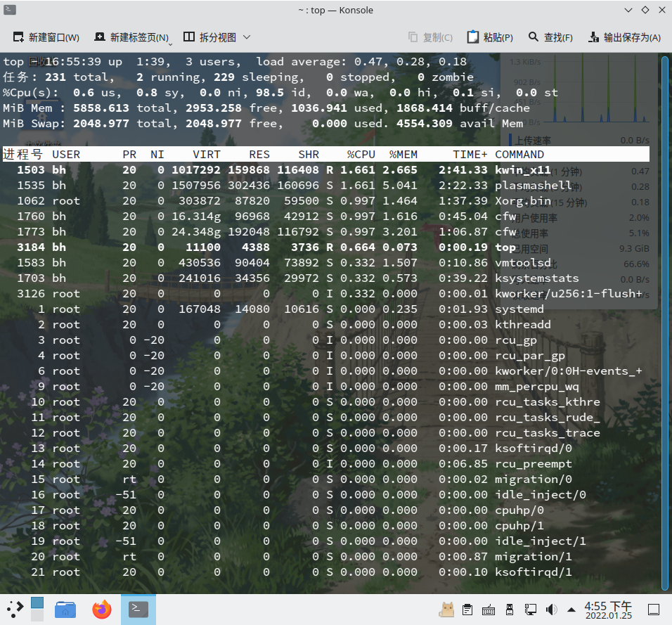

# 管理运行进程

## 理解进程

Linux 是一个多用户系统，支持许多程序同时运行。

进程（process）是命令的运行实例。例如，系统上可能有一个 `nano` 命令。但如果 `nano` 当前由 15 个不同的用户运行，则该命令由 15 个不同的运行进程表示。

每一个的进程都会有一个独一无二的 PID（进程标识符，process ID），Linux 使用 PID 识别进程，并将同一程序的不同进程进行区分。当进程结束后，PID 就会被系统回收，分配给新的进程。

除了 PID，一个进程还会具有其他的属性，如，进程所属的用户和用户组，这将决定系统如何为一个进程分配系统资源。管理进程是 Linux 系统管理员的重要技能之一。

## 列举进程

### 使用 ps 列出进程

在命令行界面中，最常用于列出运行进程的命令行工具是 `ps`。使用该命令即可查看正在运行的进程。

```
bh@localhost:~> ps u
USER        PID %CPU %MEM    VSZ   RSS TTY      STAT START   TIME COMMAND
bh         2400  0.0  0.1   9968  6372 pts/1    Ss   15:55   0:00 /bin/bash
bh         2447  100  0.0  10520  3676 pts/1    R+   15:55   0:00 ps u
```

如上，`u` 或 `-u` 选项用于显示用户名和其他信息，如进程开始的时间、与归属于当前用户的进程的 CPU 和内存使用情况。上述显示的进程均和当前的终端（`tty1`）关联在一起。在图形化界面未发明之前，人们都是通过字符终端控制系统，一个终端通常就代表一个用户。如今，通过在桌面上打开多个虚拟终端或终端窗口，你可以在一个屏幕上拥有多个“终端”。如上终端设备 `tty1` 正在用于登录会话。

`USER` 列显示了启动该进程的用户名。`PID` 列显示进程的 PID。你可以通过将 PID 作为参数指定进程管理命令对使用该 PID 的进程发送相关的信号（如，重启、结束或挂起）。`%CPU` 和 `%MEM` 列显示了进程使用的 CPU 资源和 RAM 资源（按百分比计算）。

`VSZ`（虚拟集大小）显示图像进程（image process）的大小（以千字节 kb 为单位），`RSS`（驻留集大小）显示进程占用物理内存的大小。`VSZ` 和 `RSS` 的大小可能不同，因为 `VSZ` 是为进程分配的内存量，而 `RSS` 是实际使用的内存量。`RSS` 内存表示不能交换的物理内存。

`STAT` 列代表了进程的状态，`R` 表示正在运行，`S` 表示该进程已经睡眠。`START` 显示了进程开始运行的时间，`TIME` 显示进程累积使用的系统时间（许多命令消耗的 CPU 时间非常短暂，所以 TIME 为 00:00）。

除了以上的这些进程，Linux 系统还有很多不关联终端的进程。这些在后台运行的进程处理着大量事务（比如发现新设备、启动时唤醒图形界面和管理系统资源）。它们随着系统的启动而运行，随着系统关闭或用户注销（部分后台进程不会因为用户注销而停止）而停止。

要以当前用户的身份查看 Linux 系统上运行的所有进程，键入：

```
$ ps ux | less
```

要查看所有的进程，键入：

```
$ ps aux | less
```

你可以使用 `-o` 选项和 `--sort` 选项对 ps 的输出结果进行修改和排序。如：

```
bh@localhost:~> ps -eo pid,user,uid,group,gid,vsz,rss,comm | less
   PID USER       UID GROUP      GID    VSZ   RSS COMMAND
     1 root         0 root         0 167048 14080 systemd
     2 root         0 root         0      0     0 kthreadd
     3 root         0 root         0      0     0 rcu_gp
     4 root         0 root         0      0     0 rcu_par_gp
     6 root         0 root         0      0     0 kworker/0:0H-events_highpri
... ...
bh@localhost:~> ps -eo pid,user,group,gid,vsz,rss,comm --sort=-vsz | head
   PID USER     GROUP      GID    VSZ   RSS COMMAND
  1543 bh       bh        1000 268746444 32796 baloo_file
  1773 bh       bh        1000 25530864 191624 cfw
  1577 bh       bh        1000 21425924 152472 cfw
... ...
```

如上，`-e` 选项能列出全部的进程，`--sort=-vsz` 选项将输出按 `VSZ` 进行降序排列。

是不是看着很繁琐，且你无法查看实时运行情况？

### 使用 top 列出和更改进程

`top` 也是一个常用的命令，用于实时查看进程和系统概况：



`top` 命令默认根据进程消耗的 CPU 资源（`%CPU`）进行排序。在发现异常进程后，你可以使用 `top` 终止进程（`kill`）或者重新设定进程优先级（`renice`）。

如果你希望能够终止或取消任何进程，则需要以 root 用户身份运行 top。如果你只想显示进程并可能终止或更改你自己的进程，你可以普通用户的身份执行此操作。

有关系统的概况显示在 `top` 输出的顶部，然后是有关每个正在运行的进程的信息（或至少与屏幕上显示的一样多）。你可以使用 `top` 查看系统运行了多长时间，当前有多少用户登录到系统，以及过去 1、5 和 10 分钟的系统平均负载。其他概况信息包括当前正在运行的进程（任务）数量、正在使用的 CPU 数量以及可用和正在使用的 RAM 和 SWAP 空间。

概况信息的下方是进程列表，该列表按每个进程使用的 CPU 百分比排序。默认情况下，所有这些信息每 5 秒重新刷新一次。按 h 键查看帮助选项，然后按 q 或 Esc 键返回 `top` 输出界面。

按下 k 键，然后输入进程的 PID 即可杀死（强制终止）该进程。

### 使用 Htop 列出进程

`htop` 是一个类似 `top` 的进程管理器，支持使用鼠标控制进程。


- 在 openSUSE 上安装 `htop`：`$ sudo zypper in htop`
- 在 Fedora 上安装 `htop`：`$ sudo dnf in htop`

要启动 htop，只需要输入命令：`htop` 即可。

你可以使用鼠标点击选中某个进程，然后再点击底栏的按钮（如 `Nice -`、`Nice +` 或 `Kill`）对进程进行管理。要退出 `htop`，点击底栏最右侧的 `Quit` 或按 q 键退出。

### 使用系统监视器列出进程

每个桌面环境都有一个图形化系统监视器用于管理进程。 KDE 桌面默认使用 `plasma-systemmonitor`，xfce4 桌面默认使用 `xfce4-taskmanager`，gnome 桌面环境默认使用 `gnome-system-monitor`。

以 `plasma-systemmonitor` 为例，打开该应用程序，在左侧点击**进程**，进入进程页面。你可以点击顶栏，将进程按照某一要求（如进程名，内存使用量）进行升序或降序排序。然后鼠标右键点击你要控制的进程，然后**发送信号**（如待机、挂起或强制终止等）至进程。

## 管理后台和前台进程

在图形化界面中，你可以同时运行多个程序，然后在它们之间不断切换。在命令行界面中，你所看到的似乎就是你所运行的全部程序。

虽然 shell 不能让你同时运行多个程序，但允许你把活跃的进程移动至后台或前台。这样你就能同时运行多个程序，并处理其中的一个活动进程。

### 运行后台进程

要将进程放至到后台，你可以在命令运行的时候，按下快捷键 `Ctrl + Z` 或在输入的命令末尾加上 `&`，如：

```
bh@localhost:~> find ~ > ~/filelist &
[3] 8855
```

如上，该命令会将你用户目录（`$HOME`）下的所有文件都打印出来，然后导入到 同一目录的 `filelist` 纯文本文件中，该命令是在后台运行。在将进程放至后台时，你可以同时看到和该进程相关的 job 值（`[3]`）和进程 ID（`8855`）。要查看当前后台运行的进程，请输入 `jobs`：

```
bh@localhost:~> jobs
[1]-  已停止               sudo zypper ref
[2]+  已停止               htop
[3]   已完成               find ~ > ~/filelist
```

如上，第一个进程（Job 1）是一个刷新元数据的进程，第二个进程是 `htop`，第三个进程则是刚刚放至后台的 `find`。

紧随 job 数字后加号 (+) 表示它最近被放置在后台中，减号 (-) 表明它在最近的后台进程被放置到后台之前就已经被放置在后台。前两个任务因为都需要终端的输入，所以它们无法在后台运行，只能进入`已停止`的状态，直到用户将它们切换到前台。第三个命令由于不需要终端的输入，所以它在完成任务后，会自动退出（并显示`已完成`）。

### 将命令切换到前台

你可以使用 `fg` 命令将特定的进程切换到前台，如上文的中例子，要将第二个进程切换到前台，你可以输入：`$ fg 2`。

## 强制终止和调整优先级

