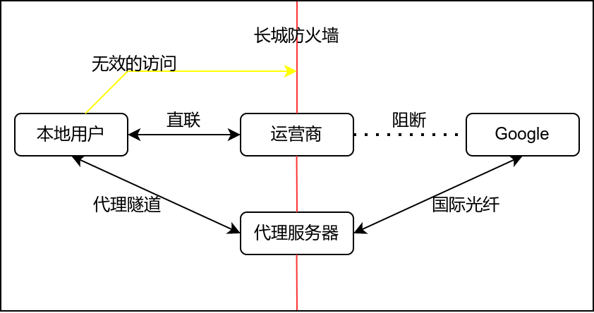

## 简述

### 什么是网络代理



所有人都是通过运营商提供的宽带服务接入互联网的，而出于一些原因，运营商必然屏蔽或者对一些网站加以阻断，导致用户无法通过直联访问一些站点（Google）。而用户几乎不可能在没有专线的情况下绕过防火墙直联访问谷歌。此外，还有很多的网站因为和国内用户相距遥远，用户通过直联的访问这些站点，经常会遇到延迟高，加载缓慢的情况。

这个时候就需要使用代理工具链接到可以正常访问谷歌服务的服务器。

### 为什么需要网络代理

因为有难以计数，与 Linux 相关的各类站点（文档、手册、用户论坛或软件源等）被阻断，干扰甚至屏蔽了。你若是想要有一个良好的 Linux 体验，很难绕开配置网络代理这一步。

并且相对于 Fedora，openSUSE 用户因为这种网络问题，会遇到的问题会更多。其中最为显著就是后文即将阐述的 NVIDIA 独显驱动程序的安装。

### 需要准备什么

1. 大致了解一些常用的通用代理工具和它们的使用方法。
2. 考虑是使用他人搭建的代理服务器还是自行搭建代理服务器。
3. 在本地系统为其他应用配置代理。

## 获取服务

如果你有钱有时间，愿意折腾，可以参考下文的社区文档，自行搭建代理服务器。否则你应该考虑购买付费的代理服务，或者查找免费的代理节点。相关的内容（免费节点，机场测评）都可以通过搜索引擎查询关键字获得。这里不再介绍。

### 自行搭建网络代理

!!! note
    除了下面罗列的代理工具以外，还有很多并不广泛流行的代理工具。这里就不一一罗列。

此方面的内容请参考相关社区的用户文档和开发者指南：

- [快速开始 -- v2ray](https://www.v2fly.org/guide/start.html)
    * [新 V2Ray 白话文指南](https://guide.v2fly.org/)
    * [V2Ray 白话文配置指南](https://toutyrater.github.io/)
- [Trojan Documentation](https://trojan-gfw.github.io/trojan/)
- [Clash Wiki](https://github.com/Dreamacro/clash/wiki)

## 获取常用的客户端

### v2rayA

!!! note
    v2rayA 是一个易用而强大的，专注于 Linux 的 V2Ray 客户端

对于 Fedora 用户，首先需要启用一个第三方 copr 仓库：

```
sudo dnf copr enable zhullyb/v2rayA
```

然后安装 v2ray-core:

```
sudo dnf install v2ray-core
sudo zypper install v2ray-core
```

再启动 v2raya 服务：

```
sudo systemctl start v2raya v2ray --now
```

对于 openSUSE 用户，则需要手动从 [GitHub](https://github.com/v2rayA/v2rayA/releases) 上下载与你的系统相对应的 rpm 软件包（installer_redhat_*.rpm）

然后安装软件：

```
sudo rpm -i installer_redhat_*.rpm
```

后续操作详见：

- [v2raya - 快速上手](https://v2raya.org/docs/prologue/quick-start/)
- [v2raya - 用户手册](https://v2raya.org/docs/manual/)
- [v2raya - 高级应用](https://v2raya.org/docs/advanced-application/)

### Clash For Windows

Clash 是一个使用 Go 语言编写，基于规则的跨平台代理软件核心程序。 Clash for Windows 是一个流行的图形化 Clash 分支。支持的协议： Vmess, Shadowsocks, Snell , SOCKS5 , ShadowsocksR（在0.11.2版本加入） ​。

你首先需要从 [GitHub](https://github.com/Fndroid/clash_for_windows_pkg/releases) 上下载最新发布的 `Clash.for.Windows-*-x64-linux.tar.gz`。

然后将下载得到的压缩包解压，打开解压后的文件夹。点击启动名为 `cfw` 的可执行文件即可启动 cfw。

有关添加订阅服务的指南详见[此处](https://help.loliloli.live/jiao-cheng/windows/windows)。

#### flatpak

!!! note
    并不建议通过 flatpak 安装，因为 flatpak 也时常受到运营商阻断。

Clash For windows 可通过 flatpak 安装：

```
flatpak install flathub io.github.Fndroid.clash_for_windows
```

----

## 为本地应用设置代理

### 环境变量类

环境变量是最原始的方式。理论上讲，所有合格的 Unix 程序都会遵循环境变量，而 YaST、桌面环境的设置中心（如KDE的系统设置）、`/etc/sysconfig/proxy` 配置文件本质上是这种方式。

假设，您代理软件支持以下代理方式，并且监听地址是 127.0.0.1 ，socks 监听端口是 1089，HTTP 端口是 8889，那么，sock 代理地址应该为：`socks://127.0.0.1:1089`

#### 临时环境变量

```
ip=<代理服务器IP>&&port=<代理服务器端口>&&export http_proxy=http://$ip:$port&&export https_proxy=http://$ip:$port
# 例如 ip=127.0.0.1&&port=8889&&export http_proxy=http://$ip:$port&&export https_proxy=http://$ip:$port
```

取消代理

```
unset http_proxy&&unset https_proxy
```

#### Sysconfig

打开 `/etc/sysconfig/proxy` 文件：

```
sudo nano /etc/sysconfig/proxy
```

在文件中添加下列行：

```
  PROXY_ENABLED="yes"
  HTTP_PROXY="http://127.0.0.1:8889/"
  HTTPS_PROXY="http://127.0.0.1:8889/"
  FTP_PROXY="http://127.0.0.1:8889/"
  SOCKS_SERVER="socks://127.0.0.1:1089"
  SOCKS5_SERVER="socks://127.0.0.1:1089"
```

### proxychains-ng

!!! note
    使用 proxychains-ng 和 alias 命令，可以在不修改系统代理配置的情况下，让包管理器使用代理服务。

你可以使用 ProxyChains 劫持系统进程，强行代理。

ProxyChains 是一个 UNIX 程序，它通过预加载的 DLL（dlsym()，LD_PRELOAD）钩住动态链接程序中与网络相关的 libc 函数，并通过 SOCKS4a/5 或 HTTP代理重定向连接。它仅支持 TCP 连接（不支持 UDP、ICMP 等）。实际使用过程中，一些 Java、Go 应用不会遵循 Proxychains。

```
sudo zypper in proxychains-ng
sudo dnf in proxychains-ng
```

然后编辑配置文件：

```
sudo nano /etc/proxychains.conf
```

然后在文件的末尾输入代理服务器地址和端口（具体取决于你代理服务的配置，如果你的代理服务软件支持 socks 代理，你可以考虑只填入 socks5 ），例如：

```
quiet_mode
http 127.0.0.1 8889
socks5 127.0.0.1 1089
```

然后保存并退出文件。

#### 示例

劫持普通程序：

```shell
$ proxychains4 <你的命令行>
#例如：proxychains4 wget google.com
```

劫持需要 Root 权限的程序：

在原有的 sudo 命令后，插入 proxychains4 ，例如：

```
sudo proxychains4 zypper ref
```

#### 使用 alias 简化操作

在计算机中，`alias` 是各种命令行解释器（shell）中的一个命令，它可以用另一个字符串替换一个单词。它主要用于缩写系统命令，或为常用命令添加默认参数1。`alias` 是一个非常实用的命令。

它的常见格式是

```
alias word="command"
```

为了使得 alias 的命令永久化，你可以在 `.bashrc` 文件中添加别名，这样每当 shell 启动新会话的时候，它就会在自动读取你设置好的别名。

```
nano ~/.bashrc
```

在 `~/.bashrc` 中添加下列行：

!!! note
    Bash 只检查命令的第一个单词是否有别名，之后的任何单词都不会检查。这意味着在像 `sudo l` 这样的命令中，bash 只检查第一个单词 (sudo) 的别名，忽略 l（`alias l="ls -alF"`）。你可以通过在别名值的末尾添加一个空格来告诉 bash 检查别名之后的下一个单词（即 sudo）。

```shell
alias sudo="sudo "
#让 shell 识别 sudo 后面出现的别名
alias pyc="proxychains4"
#更短的命令
alias flatpak="proxychains4 flatpak"
#对 flatpak 使用代理
alias zypper="proxychains4 zypper"
#对 zypper 使用代理
alias dnf="proxychains4 dnf"
#对 dnf 使用代理
```

然后运行 `source` 命令使新配置生效：

```
source ~/.bashrc
```

然后打开一个新的终端窗口即可。如果你不需要某些别名，只需要将它们从文件中删除即可。

### 浏览器扩展

Firefox 的设置中有一个单独的网络代理设置，你可以在此处直接指定代理服务器。

chrome 则需要在终端中启动:

```shell
$ google-chrome-stable --proxy-server=http://example.com:proxy_port
#例如 google-chrome-stable --proxy-server=http://127.0.0.1:20171
```

SwitchyOmega 等浏览器插件可为浏览器提供代理服务。你可以在 [chrome](https://chrome.google.com/webstore/detail/proxy-switchyomega/padekgcemlokbadohgkifijomclgjgif) 和 [Firefox](https://addons.mozilla.org/en-US/firefox/addon/switchyomega/) 的扩展商店里面找到它们。

## 其他

以下是两个富有实践价值的指南：

- [Thanks-Mirror](https://github.com/eryajf/Thanks-Mirror)  
    * 分享的是包管理器直接可用，质量好，速度快的镜像，以及一些其他常用软件，系统镜像的国内镜像。 
- [package manager proxy settings](https://github.com/comwrg/package-manager-proxy-settings)  
    * 记录各个包管理器代理设置坑点。 