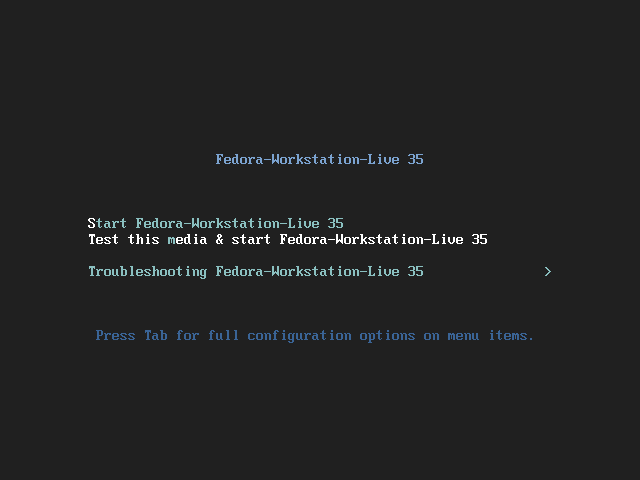
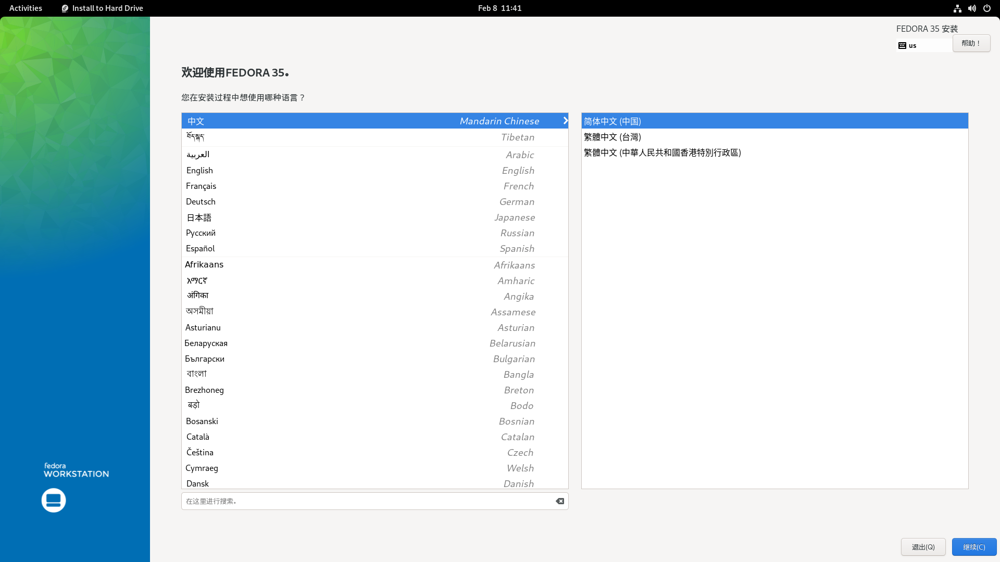
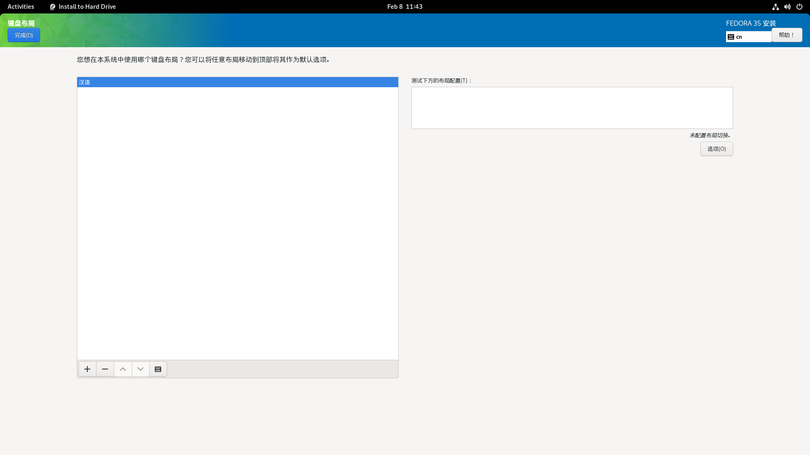
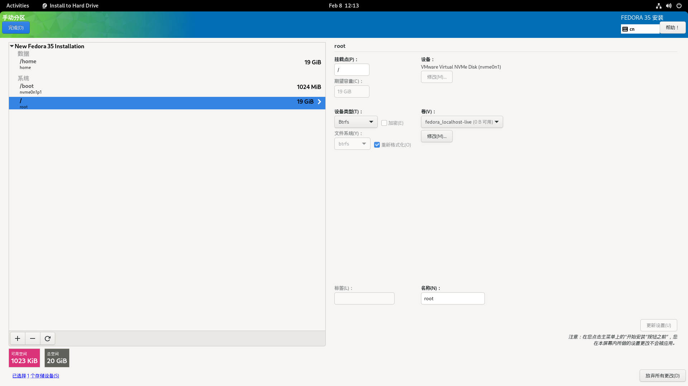
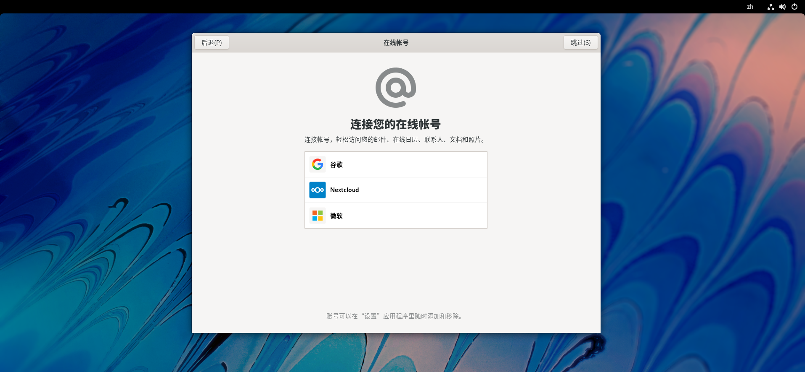
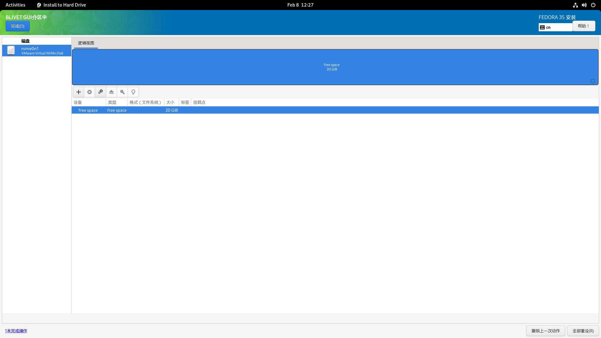
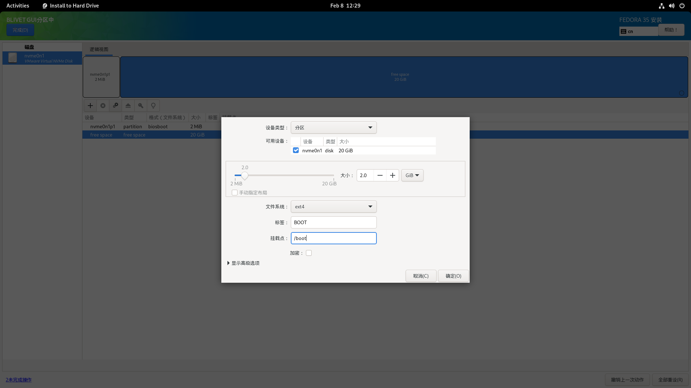

# 安装 Fedora

## 概述

Fedora 是一个流行的发行版，它有很多的分支，本文只描述使用 LiveDVD 镜像安装 Fedora Workstation 以及物理机双系统（Windows 10 & Fedora）所需要注意的事项。

- 参考：[Fedora 35 - Installation Guide](https://docs.fedoraproject.org/en-US/fedora/f35/install-guide/)

## 安装前准备

请参照[前文](./pre-install.md)自行制作安装介质。

- 如果你不喜欢 Workstation 的桌面环境（Gnome Desktop），你可以选择 [Fedora Spin](https://spins.fedoraproject.org/)。

## 使用 Anaconda 安装系统

将 U 盘插入电脑并重启，你就会看到 Fedora 的引导启动页面，选择 **Test this media & start Fedora-Workstation-Live 35**，进入下一步。

在系统完成自检后，你就会进入到 Fedora Live 环境：

你此时可以体验一下 Fedora 的图形界面（Gnome 桌面环境），你此时所作出的更改基本不会影响到电脑原有的文件和设备。如果你想要立即进行安装系统，请点击 **Install To Hard Drive**

然后你就会进入 Anaconda 的操作界面：

### 语言

启动 Anaconda 后，第一步是选择语言，找到**中文**，并选择**简体中文**（如果你已经连接到网络，Anaconda 会自动选择语言），然后进入下一步。

!!! attention
    选择语言后，你无法更改语言，除非你停止并重新启动安装程序，才能再次选择语言。

然后你就会进入安装信息摘要页面：

由于 workstation 的特点，此时你只能先配置语言、键盘、网络和安装位置。剩余内容需要等待安装完成后，初次启动系统才能配置。

### 键盘

打开**键盘**页面，如果你发现当前键盘布局不正确，或你需要其他语言的键盘布局，请点击左下方的加号，进行添加：

减号按钮用于删除，上下箭头按钮用于排序键盘布局的优先级。

### 时间和日期

打开**时间和日期**页面，检查时区和地区是否正确：

如果你发现时区不正确，在世界地图上点击你所在的位置。然后点击左上方的**完成**确认更改。

### 安装目的地

你可以在**安装目的地**中，对 Fedora 安装位置进行设置。

注意，此步需要对硬盘分区进行更改和读写，如果你不熟悉如何手动创建，挂载分区，请使用自动分区。

#### 自动分区

你可在**本地标准磁盘**中勾选提前划分的空闲磁盘空间，然后在存储配置中选择**自动**进行自动分区。最后点击两次左上方的 **完成(D)** 确认更改即可。

#### 手动分区

- 有关使用 Blivet-GUI 进行分区的内容详见后文。

要进行简单的手动分区：

请在**本地标准磁盘**中勾选提前划分的空闲磁盘空间，然后在存储配置中选中**自定义**，然后点击左上方的 **完成(D)** 即可进入手动分区。

推荐使用默认的分区方案，然后点击上方的 **点击这里自动创建它们**，然后 Anaconda 就会自动创建分区表：

点击两次左上方的 **完成(D)** 确认更改即可。

最后回到安装信息摘要的首页，点击右下方的 **开始安装(B)** 开始安装 Fedora。

Fedora 很快就会安装到你的设备上，这时你可以放松一下~

## 安装后初次启动

安装完成后，重启系统，系统会自动进入配置页面，你可以在此处完成剩余的配置。

### 隐私

请根据你个人情况和喜好进行选择：

### 第三方软件源

此时，你可以选择是否开启第三方[软件源](https://rpmfusion.org)。

如果你使用了非自由固件（如 NVIDIA 设计的独显，个别厂商生产的网卡）或非其他分发受限软件（一些私有固件驱动，多媒体解码器）。那么建议你开启第三方软件源：

### 在线账户

你可以在此处登录你的网络账户，或者跳过：

### 创建用户

你可以在此处创建你的系统账户，请输入用户全名和用户名

- 用户全名是你的账户全称，用户名则是你的账户简称。建议设置一个简短的用户名。
- 点击头像即可切换头像图片。

然后设置一个安全的，不低于 6 位的密码，注意保管好你的密码，一旦忘记密码是无法找回的。

### 收尾工作

最后，点击 **开始使用 Fedora Linux** 进入系统。

祝你玩的愉快！(¬‿¬)

----

## 进阶内容

!!! attention
    以下内容要求操作者对于 Linux 具有一定的基础知识。

### 使用 Blivet-GUI 进行手动分区

要使用 Blivet-GUI 进行手动分区：

首先点击选中你之前预留的未分配的磁盘空间（你可以同时选中多个硬盘）。然后在下方存储配置中选择**高级自定义 (Blivet-GUI)**，点击**完成(D)**进入配置页面：

选中右侧逻辑视图下方的 free space，点击上方工具栏的加号，添加一个新的分区：

!!! note
    若磁盘没有分区表或者你打算删除原有系统进行一次全新的安装，Anaconda 会提示你选择新分区表类型（推荐设置为 GPT）。

为了安装 Fedora，你至少需要 `/` 和 `/boot` 两个基本的分区。

|分区|描述|
|---|---|
|`/boot`|这个分区包含操作系统内核和在引导过程中使用的其他文件。推荐大小为 1GB。文件系统类型可设置为 `ext4`。|
|`/boot/efi`|独立的 [EFI](https://wiki.archlinux.org/title/Unified_Extensible_Firmware_Interface) 分区，推荐当 Fedora 需要与 Windows 共存时创建该分区，大小为 512MB，格式为 `vfat` 或 `fat32`。|
|`/(root)`|这是根目录所在的位置。根目录是目录结构的顶层。默认情况下，所有文件都写入此分区，除非在写入的路径中安装了不同的分区（例如，`/boot` 或 `/home`）。
Fedora 现在已经使用 [Btrfs](https://wiki.archlinux.org/title/Btrfs) 卷作为根目录的默认文件系统。官方推荐大小为 25GB 及以上。实际上你只需要保证根目录大于 15GB 即可。|
|`/home`|独立的用户目录，具体大小取决于你想要放入多少文件；不是必需的分区。分区格式为 `xfs`、`ext4` 或 `btrfs` 等你所偏好的分区格式。|
|`biosboot`|如果你的硬盘使用了 [MBR](https://wiki.archlinux.org/title/Partitioning#Master_Boot_Record_(bootstrap_code)) 分区表而不是 [GPT](https://wiki.archlinux.org/title/Partitioning#GUID_Partition_Table) 分区表作为启动盘的分区形式，则你需要额外创建一个大小为 1MB，格式为 `biosboot` 的空白分区。|
|`swap`|[交换分区](https://wiki.archlinux.org/title/Swap)，Linux 将物理内存分为内存段，叫做页面。交换是指内存页面被复制到预先设定好的硬盘空间(叫做交换空间)的过程，目的是释放这份内存页面。物理内存和交换空间的总大小是可用的虚拟内存的总量。分区格式为 `swap`。|

SWAP 分区推荐大小如下所示：

|系统物理内存（RAM）大小|推荐的 swap 分区大小|推荐的 swap 分区大小（如果需要休眠）|
|---|---|---|
|小于 2GB|RAM 的两倍|RAM 的三倍|
|2GB - 8GB|和 RAM 相同|RAM 的两倍|
|8GB - 64GB|RAM 的 0.5 倍|RAM 的 1.5 倍|
|大于 64GB|基于实际工作负载而定|不推荐休眠|

!!! note
    延伸阅读：[MBR 与 GPT](https://zhuanlan.zhihu.com/p/26098509)

综上，

对于 BIOS 设备：

- **/boot**：设备类型设置为**分区**，大小设置为 1GB，文件系统设置为 `ext4`，挂载点设置为 `/boot`。
- **biosboot**：设备类型设置为**分区**，大小设置为 1~2MB，文件系统设置为 `BIOS Boot`。
- **swap**：设备类型设置为**分区**，大小请参考上表而定，文件系统设置为 `swap`。
- **/(root)**：设备类型设置为 **Btrfs 卷**，大小设置为剩余空闲空间大小。
- **/home**：*请根据实际需要创建该分区*。设备类型设置为**分区**，大小和文 件系统类型依照实际需要而定，挂载点为 `/home`。

对于 UEFI 设备：

- **/boot**：设备类型设置为**分区**，大小设置为 1GB，文件系统设置为 `ext4`，挂载点设置为 `/boot`。
- **/boot/efi**：设备类型设置为**分区**，大小设置为 512MB，文件系统设置为 `vfat` 或 `fat32`，挂载点为 `/boot/efi`。
- **swap**：设备类型设置为**分区**，大小请参考上表而定，文件系统设置为 `swap`。
- **/(root)**：设备类型设置为 **Btrfs 卷**，大小设置为剩余空闲空间大小。
- **/home**：*请根据实际需要创建该分区*。设备类型设置为**分区**，大小和文件系统类型依照实际需要而定，挂载点为 `/home`。

如果你创建了错误的分区，可以点击 “+” 右侧的 “X” 删除错误的分区，或者右下方的**撤销上一次操作**进行回退。完成创建分区后，点击两次右上角**完成**确认分区结果即可。

小技巧：

- 创建分区的时候，先创建小分区（如：`/boot`），再创建大分区（如：`/home`）。
- 独立的 `/boot/efi` 可避免 Windows 更新 EFI 分区时导致损坏 Linux 的引导文件的可能情况（Windows Boot Manager 不是为多系统引导而设计的）。
- 不创建 `swap` 分区也可安装 Fedora。
- 独立的 `/home` 不是必须的，你也可以编辑现有的磁盘分区或创建一个新的大分区（用于储存大量个人文件），设置挂载点挂载到 `/` 或 `/home` 下（如果挂载的分区存储有重要文件，请勿格式化该分区）。