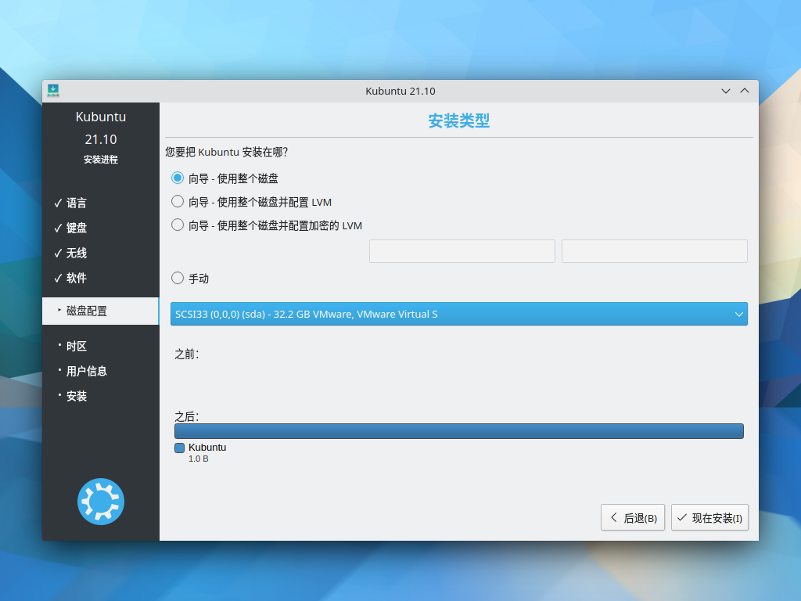
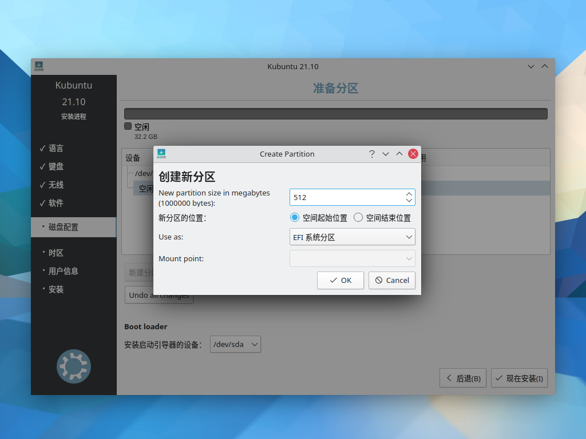
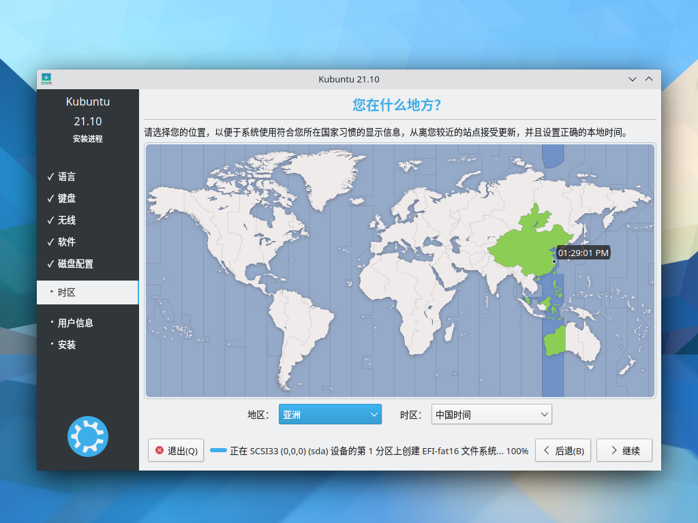
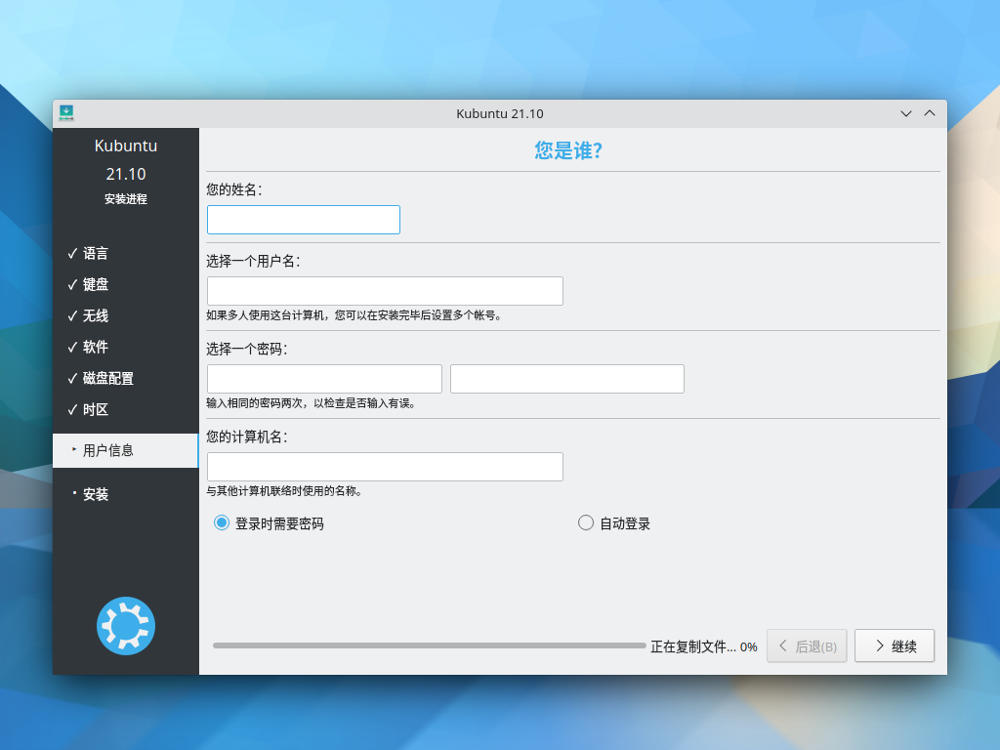
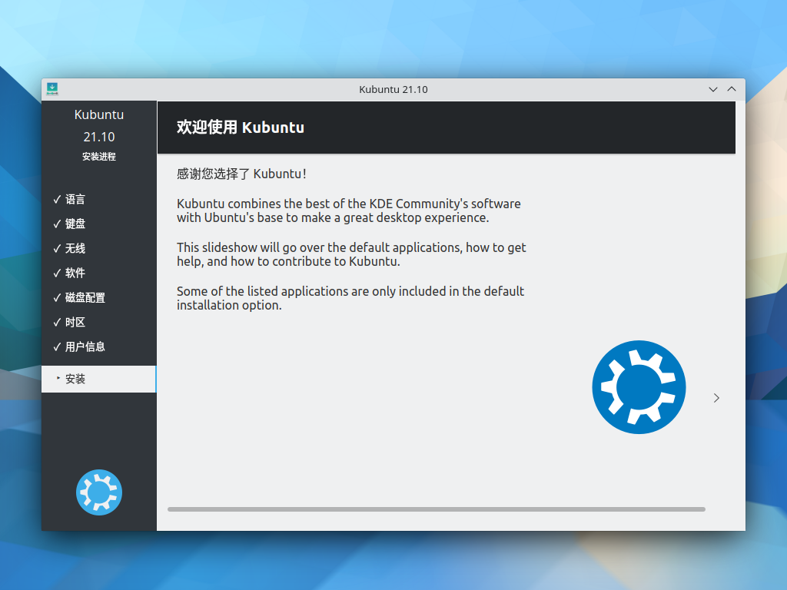

# 安装 Kubuntu

## 简介

Kubuntu，是众多 Ubuntu 分支的一种，它采用 KDE Plasma 桌面为其默认桌面环境。它和 Ubuntu 采用同样的底层系统和软件库。基本上，Kubuntu 和 Ubuntu 没有太大的差异，只是默认桌面系统采用 KDE，并非 GNOME 或 Unity。

## 获取 ISO 镜像

Kubuntu 和 Ubuntu 有三种方式获得镜像文件：

1. 直接前往官网[下载 ISO 文件](https://kubuntu.org/getkubuntu/)。
2. 前往镜像站下载文件，Kubuntu 的镜像一般与 Ubuntu 和其他的 Ubuntu 支系放在同一个目录中：`/ubuntu-cdimage/kubuntu/`，找到并下载最新的镜像，如 `kubuntu/releases/21.10/release/kubuntu-21.10-desktop-amd64.iso`
3. 使用 torrent 下载 ISO 文件。你可以在 [Alternative downloads](https://kubuntu.org/alternative-downloads/) 页面中找到适用于 BitTorrent 或其他标准 BT 下载器的 torrent 文件。有关于此，请阅读 [XIU2/TrackersListCollection](https://trackerslist.com/#/zh)。

### 校验文件

你可以参照[前文](./create-media.md)对 ISO 进行校验。官方文件的校验和可在[此处](https://kubuntu.org/alternative-downloads/)找到：

```
kubuntu-21.10-desktop-amd64.iso: 4a56cfc43e0f4ead6b7e66b3da67ab22d96c46dc090190a06d2848b6e03fe02a
kubuntu-20.04.3-desktop-amd64.iso: 11bca68f3366b11c7887666124e0155c6e2fbe1350ab14f25cd15299ac8f68b5
```

## 安装

### 引导界面

在配置完虚拟机设置或插入安装介质并重启系统后，你会进入 GRUB 引导界面，请选择 `Kubuntu`。


### 欢迎

登录系统后，你会看到欢迎界面，请在此页面将语言调成“中文（简体）”，然后点击“安装 Kubuntu”进行安装系统：


### 键盘布局

请确认键盘布局是否正确：


### 更新和其他软件

在“更新和其他软件”页面中，选择“正常安装”，如果你不需要安装时更新系统，请取消勾选“安装 Kubuntu 时下载更新”；如果你需要为提前设备安装 NVIDIA 独立显卡驱动、多媒体解码器和无线固件等内容，你可以勾选“为图形或无线硬件，以及其他媒体格式安装第三方软件”：


### 磁盘分区

!!! attention
    Kubuntu 的安装流程与其他系统略有不同，它会在用户确定并接受分区方案后立即开始安装系统。

你可以选择使用自动分区，但是请注意选择正确的空闲磁盘分区：



如果需要手动分区请选择“手动”：

#### 手动分区

当你选择将 Kubuntu 安装至一个新磁盘时，它会提醒你创建一个磁盘分区表：


一般地，你需要以下分区：

|分区名|挂载点|建议大小|分区类型|
|---|---|---|---|
|EFI|-|512MB|EFI 系统分区|
|swap|-|详见下表|交换空间|
|/|/|20GB 及以上|btrfs、ext4 均可|
|/home|/home|依照实际情况而定|btrfs、ext4、xfs 均可|

SWAP 分区推荐大小如下所示：

|系统物理内存（RAM）大小|推荐的 swap 分区大小|推荐的 swap 分区大小（如果需要休眠）|
|---|---|---|
|小于 2GB|RAM 的两倍|RAM 的三倍|
|2GB - 8GB|和 RAM 相同|RAM 的两倍|
|8GB - 64GB|RAM 的 0.5 倍|RAM 的 1.5 倍|
|大于 64GB|基于实际工作负载而定|不推荐休眠|

点击“空闲”区域即可创建新的分区：

创建 EFI 分区（建议大小 512MB）：



创建系统交换分区：


创建根分区（此处使用 btrfs 文件系，你也可以选择 ext4）：


如果你需要修改或删除分区，请点击该页面的相关按钮。确认分区无误后，点击 “现在安装”，安装器会提醒你最后确认一次文件系统变更。

接下来请选择你所在的时区和地区：



### 您是谁？

然后设置你的用户全名、用户名、用户密码、主机名。如果不需要自动登录，则你需要为系统设置密码：



### 完成！

崭新的 Kubuntu 很快就会安装完成，安装结束后请拔出 U 盘并重启计算机进入新系统。

