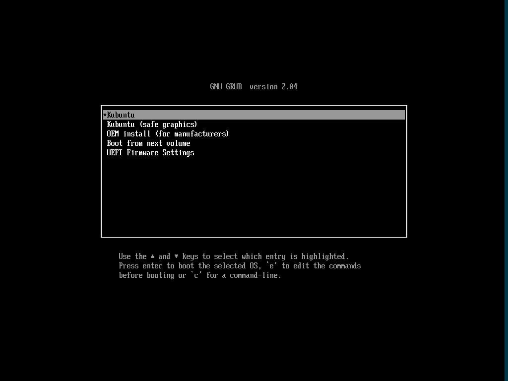

# 安装 Kubuntu

## 简介

Kubuntu，是众多 Ubuntu 分支的一种，它采用 KDE Plasma 桌面为其默认桌面环境。它和 Ubuntu 采用同样的底层系统和软件库。基本上，Kubuntu 和 Ubuntu 没有太大的差异，只是默认桌面系统采用 KDE，并非 GNOME 或 Unity。

## 获取 ISO 镜像

Kubuntu 和 Ubuntu 有三种方式获得镜像文件：

1. 直接前往官网[下载 ISO 文件](https://kubuntu.org/getkubuntu/)。
2. 前往镜像站下载文件，Kubuntu 的镜像一般与 Ubuntu 和其他的 Ubuntu 支系放在同一个目录中：`/ubuntu-cdimage/kubuntu/`，找到并下载最新的镜像，如 `kubuntu/releases/21.10/release/kubuntu-21.10-desktop-amd64.iso`
3. 使用 torrent 下载 ISO 文件。你可以在 [Alternative downloads](https://kubuntu.org/alternative-downloads/) 页面中找到适用于 BitTorrent 或其他标准 BT 下载器的 torrent 文件。有关于此，请阅读 [XIU2/TrackersListCollection](https://trackerslist.com/#/zh)。

### 校验文件

你可以参照[前文](./create-media.md)对 ISO 进行校验。官方文件的校验和可在[此处](https://kubuntu.org/alternative-downloads/)找到：

```
kubuntu-21.10-desktop-amd64.iso: 4a56cfc43e0f4ead6b7e66b3da67ab22d96c46dc090190a06d2848b6e03fe02a
kubuntu-20.04.3-desktop-amd64.iso: 11bca68f3366b11c7887666124e0155c6e2fbe1350ab14f25cd15299ac8f68b5
```

## 安装

在配置完虚拟机设置或插入安装介质并重启系统后，你会进入 GRUB 引导界面，请选择 `Kubuntu`。



登录系统后，你会看到