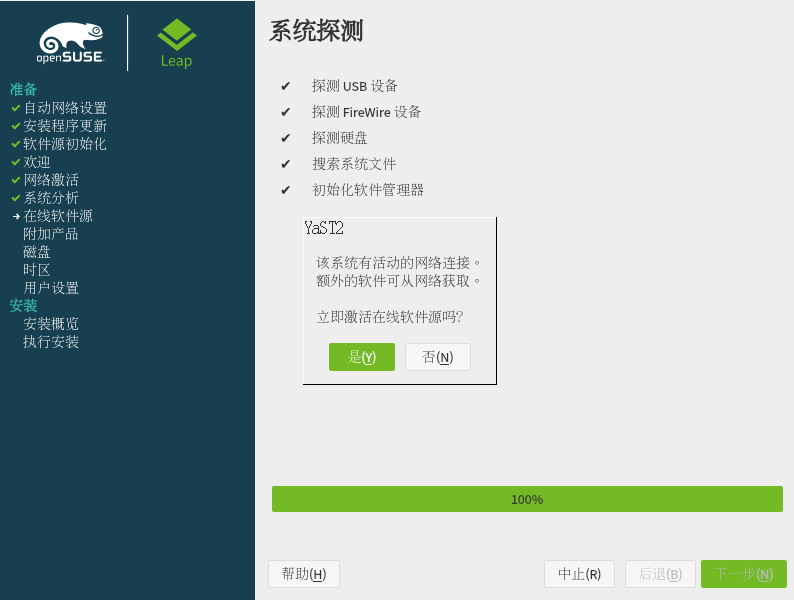

# 安装 openSUSE

## 参考资料

本文参考了 openSUSE 中文 Wiki 的一些页面：

- [为什么选择 openSUSE](https://zh.opensuse.org/%E4%B8%BA%E4%BB%80%E4%B9%88%E9%80%89%E6%8B%A9_openSUSE)
- [SDB:制作安装 U 盘](https://zh.opensuse.org/SDB:%E5%88%B6%E4%BD%9C%E5%AE%89%E8%A3%85_U_%E7%9B%98)
- [SDB:DVD 安装方式](https://zh.opensuse.org/SDB:DVD_%E5%AE%89%E8%A3%85%E6%96%B9%E5%BC%8F)

你可以前往 [openSUSE wiki](https://zh.opensuse.org/) 查阅本指南省略的部分。

## openSUSE 是什么

[openSUSE](https://zh.opensuse.org/%E4%B8%BA%E4%BB%80%E4%B9%88%E9%80%89%E6%8B%A9_openSUSE) 源自 openSUSE 项目，是一个独立的 Linux 发行版分支，使用 RPM 作为分发的软件包格式，采用 zypper 作为包管理器，同时兼容多种计算机硬件。 

openSUSE 有两个正式的发行版：[Leap](https://zh.opensuse.org/Portal:Leap) 和 [Tumbleweed](https://zh.opensuse.org/Portal:Tumbleweed)。

openSUSE 项目每 8 个月发布一个 Leap 的新版本，每个版本有 18 个月的维护周期，Leap 致力于为用户提供稳定的桌面环境和成熟的软件包。Tumbleweed 是 openSUSE 的滚动发行分支，致力于为用户提供最新的稳定版内核、软件和桌面环境。

## 准备

### 虚拟机与物理机

在不熟悉 Linux 基本知识的情况下，在物理机上安装 openSUSE 可能会导致数据丢失，或者是硬件损坏。所以，在付诸行动之前，你需要先在虚拟机上熟悉一下 Linux。

- [Virtualbox](https://www.virtualbox.org/) 是一个让你再不破坏当前系统结构的情况下，能够获得最接近原生 Linux 环境体验的工具。你也可以使用 [VMware](https://www.vmware.com/products/workstation-pro.html) 安装 openSUSE。
- 注意，在物理机上安装 openSUSE 并非是必须的步骤，不安装到物理机上可以省去大量的迁移工作，但安装到物理机上会让系统具备更强的性能和更多的功能。

### 获取 ISO 文件

我们推荐两种方法下载：一是从[官方渠道](https://get.opensuse.org/)下载，二是从 [openSUSE 镜像站](https://mirrors.opensuse.org/)下载。

为了简化流程，我们推荐使用从镜像站下载的 DVD 离线镜像安装系统（2020 年后生产的桌面设备最常见的系统架构为 `x86_64`）。

- Leap：

>下载地址：镜像站地址 + /opensuse/distribution/openSUSE-current/iso/openSUSE-Leap-15.3-DVD-x86_64-Current.iso

>如：http://mirrors.ustc.edu.cn/opensuse/distribution/openSUSE-current/iso/openSUSE-Leap-15.3-DVD-x86_64-Current.iso

- Tumbleweed：

>下载地址：镜像站地址 + /opensuse/tumbleweed/iso/openSUSE-Tumbleweed-DVD-x86_64-Current.iso

>如：http://mirrors.ustc.edu.cn/opensuse/tumbleweed/iso/openSUSE-Tumbleweed-DVD-x86_64-Current.iso

注意：

- 离线安装的 DVD 镜像体积较为庞大，我们推荐你采用 [aria2](https://aria2.github.io/)、[FDM](https://www.freedownloadmanager.org/zh/) 之类的下载管理器下载 ISO 镜像文件以避免常规浏览器下载出现网络中断的情况。
- 请打开浏览器检查一下链接是否真实可用。

### 制作安装介质

- 使用虚拟机安装 openSUSE 的用户可略过此节，直接阅读下下一节。

你可以使用 [Rufus](https://rufus.ie/zh/) 或 [balenaEtcher](https://www.balena.io/etcher/) 制作安装镜像。

- Rufus

将你的 U 盘插入电脑，打开 Rufus，它会自动选择可用的移动存储设备。点击“**选择**”打开要刻录的镜像文件。请确认选择正确的设备，然后点击底端的“**开始**”等待刻录自动完成。
- balenaEtcher

将你的 U 盘插入电脑，打开 balenaEtcher，点击最左侧的加号下面的“Flash from file”，选择要写入的ISO镜像。点击中间的磁盘图标下面的“Select target”，选择要写入的设备。点击最右边的“Flash!”按钮，开始写入。等待刻录自动完成。
- 划分未分配的磁盘空间

如果你是在实体机上安装 openSUSE，请提前用磁盘分区工具划分一个大小为 40GB （如果不使用快照功能或你会定期清理快照，可只划分 20GB）或更大的未分配的磁盘空间（不要格式化和写入文件系统）。

如果你想提高 U 盘的利用率或想一个 U 盘容纳多个操作系统的安装文件，你可以访问 [ventoy](https://www.ventoy.net/cn/index.html) 了解更多信息。

### 配置虚拟机

配置虚拟机的部分和[安装 Fedora](/docs/entry/installation/fedora.md) 的步骤大同小异，如果你发现 VMware 无法正确识别你选择的 ISO 文件，则你需要手动指定客户机操作系统类型。

## 安装系统

1. 启动系统：将 U 盘或 ISO 文件插入到电脑或虚拟机中，重新启动计算机。紧接着，你可以看到 Boot Screen（启动菜单），点击 F8 切换到简体中文页面。通过向上/向下和回车键来选择 Installation（安装）。

    

2. 欢迎界面：然后你会进入欢迎界面。在页面的顶部可以设置语言和键盘布局。设置好语言以后，YaST 会自动为您选择合适的键盘布局。如果自动选择的不正确的话，您可以通过键盘布局下拉菜单来更正它。点击**下一步**，YaST2 会开始刷新软件源，并询问你是否启用在线源。由于大陆特殊的网络环境，为了防止安装错误或中断，你应当选择否。

   

3. 选择桌面环境：接下来您可以选择一个你偏好的桌面环境来作为您的默认桌面环境（有关各个桌面的介绍详见[此处](https://zh.opensuse.org/SDB:%E5%A6%82%E4%BD%95%E4%BB%8E_Windows_%E8%BF%81%E7%A7%BB#.E6.A1.8C.E9.9D.A2.E7.8E.AF.E5.A2.83.E4.B8.8E.E4.B8.AD.E6.96.87.E7.8E.AF.E5.A2.83)）。如果你是高级用户，并想安装 KDE/GNOME/Xfce 以外的桌面环境或不需要 GUI，你可以选择**通用桌面**或**事务服务器**。

    

4. 磁盘分区：接下来显示了一个建议的磁盘分区方案。如果您在同一块硬盘上还安装了其他操作系统（比如，Windows 或者其他 Linux），YaST 不会删除它而是缩小那个系统所在磁盘的空间，好腾出足够的空间来安装 openSUSE。

   

   如果对建议配置不满意，您也可以点击**专家分区程序**。如果点击了该项，会加载分区程序，然后显示建议配置的细节以供您编辑。

   点击 从现有提案开始 ，会显示右侧用于编辑分区的界面。关于手动分区的细节将在后文详述，你也可以选择接受 openSUSE 默认的分区方案。

   

5. 设置时区：接下来，您需要设定在地图上显示的时区。您可以点击地图上的国家来选择时区，或者使用下拉菜单来选择时区。
openSUSE 会自动检测已安装的系统，如果你是计划成为 win/openSUSE 双系统用户，并且预先安装了 windows ，openSUSE 会自动取消勾选设置系统时间为 UTC 调整世界时。如果没有安装双系统的话（因为视窗系统不使用 UTC 时间），也可以把系统时间设定到 UTC 调整世界时。

    

    在时区下面显示着当前设定的时间。如果不正确的话，可以点击**手工**手动变更它。 如果您有可用的网络连接，也可以选择**与 NTP 服务器同步**来使用时间服务器。可以从下拉列表里手选一个时间服务器。点击**接受**就会自动从它同步正确的时间。

    

6. 创建主要用户：输入您的全名，openSUSE 会自动为您选择一个用户名，不满意的话也可以自己修改。指定一个新密码，并输入两次确认。系统会默认使用该密码作为系统管理员（也就是 root 根用户）的密码。同样，自动登录也是默认开启的。然而，如果您想要让系统更安全一些，或者安装的将是一个多用户系统，也可以取消自动登录。

    

    如果在前一屏中您取消选中了**对系统管理员使用此口令**选项，接下来你得为根用户 Root 提供它的认证口令（密码）。在本例中使用了一个简单密码，YaST 会对这种过于简单的密码做出警示：

    

7. 安装设置：这里是 YaST 将要对你的磁盘做什么事情的一个概览。请通读一遍列表，如果您想要改动任何一个选项，可以通过点击那个章节的标题来实现。你可以通过 YaST 的帮助文本来了解每个选项的意思。

    

    有关在此步继续对系统进行配置的指南详见[此处](https://zh.opensuse.org/SDB:DVD_%E5%AE%89%E8%A3%85%E6%96%B9%E5%BC%8F#.E7.AC.AC.E5.85.AD.E6.AD.A5.EF.BC.9A.E5.AE.89.E8.A3.85.E8.AE.BE.E7.BD.AE)。

8. 开始安装：如果你同意此概览中的内容，点击**安装**。你会被提示确认你是不是真的想要进行下去。再次点击**安装**以确认。

    

    确认后，YaST 现在正在安装您的崭新的 openSUSE 系统。在第一次重启系统前，YaST 会自动配置您系统的硬件和网络设置。一旦完成，您的计算机将自动重启。在计算机重启时，记得取出 openSUSE 安装盘或移除虚拟盘片。

## 手动分区

首先，在**建议分区**页面点击正下方的**专家分区程序**，然后你可以选择 openSUSE 预置的分区方案，也可选择自己修改分区方案。从**当前提案开始**表示你选择以 openSUSE 默认的分区方案为基础进行修改，从**现有分区开始**表示是你选择自己创建分区。

注意：

- 本文使用的演示用虚拟机的磁盘空间为 30GB（`/dev/sda`）。
- 实际操作中，SWAP 分区大小请参考[安装 Fedora - 手动分区](https://linuxhitchhiker.github.io/THGLG/entry/installation/fedora/#%E6%89%8B%E5%8A%A8%E5%88%86%E5%8C%BA)中提供的参考表格。
- openSUSE 的[硬件需求](https://zh.opensuse.org/Hardware_requirements_15.2)要求至少需要 10GB 的空间进行安装系统，如果需要图形化界面，最小的磁盘空间需要大于 16GB 。在实体机上日常使用推荐的空间大小为 40GB 及以上。
- 请不要让 windows 和 openSUSE 共享同一个 EFI 分区。
- 如果你是 Tumbleweed 用户，建议使用官方的 btrfs 文件系统，且不建议你关闭 [Snapper 快照功能](https://zh.opensuse.org/SDB:Snapper_Tutorial)。
- 在你确定接受分区方案前，你所作的更改都不会影响到原有的磁盘分区。

安装 openSUSE 所需的基本分区：

|分区名称|挂载点|分区大小|文件系统类型|
|---|---|---|---|
|root|`/`|16GB 及以上（推荐 40GB 或以上）|推荐使用 `btrfs`|
|efi|`/boot/efi/`|512MB|`fat32` 或 `vfat`|
|swap|`swap`|依照实际情况而定|`swap`|
|home|`/home`|依照实际情况而定|`xfs`、`ext4`、`btrfs` 等|

找到你预留的空白分区，首先需要先创建**交换分区**（或者你可以先创建 EFI。），请先点击你要创建分区的磁盘，例如下图中的 `/dev/sda`，点击下方的**添加分区**，然后选择自定义尺寸，并在下方输入 `2`：

点击下一步，并选择**交换区**，然后点击下一步；检查分区 ID、文件系统和挂载点是否与下图一致，然后点击下一步： 

这样我们就创建了第一个分区： 

依照同样的方法，你需要再创建一个根分区（注意，创建根分区时，请将分区的角色选择为**操作系统**，新建的根分区默认启用了 btrfs 子卷 ；`/home` 分区则应该选择**数据和 ISV 应用程序**。）： 

如果创建了错误的分区，你只需要选中错误的分区，然后点击右下角的**删除**即可。

要挂载已有的磁盘分区，只需要点击相应的分区，然后点击左下方的 **Edit**，然后添加挂载点即可。注意在编辑分区的时候，请点击**格式化设备**下方的**不格式化设备**，以免数据因为操作失误而被格式化。

如果你有大量的文件存放在机械硬盘中，考虑到 Linux 会频繁读写用户文件夹中的一些配置文件，可以先将机械盘挂载到 `/` 、`/home` 或用户文件下面，再将 `/home` 分区放在固态硬盘中（或不设立独立的 `/home` 分区）。主要目的是强调用户文件和系统文件互相隔离，但具体实操手段并不唯一。

- 我误删了某个子卷，怎么办？

点击根分区，再点击下方的 `add subvolume`，然后输入你误删的分区的名称（@ + 子卷名，如 `@/home`），然后点击**接受**。

经过一番折腾后，如果你确认你的分区方案没有问题，点击**接受**，然后再点击下一步（此时你可以预览你的分区方案）。 

### 额外内容

有关重装系统、双引导启动等内容另见 [SDB:DVD 安装方式](https://zh.opensuse.org/SDB:DVD_%E5%AE%89%E8%A3%85%E6%96%B9%E5%BC%8F#.E7.AC.AC.E5.85.AD.E6.AD.A5.EF.BC.9A.E5.AE.89.E8.A3.85.E8.AE.BE.E7.BD.AE)。
