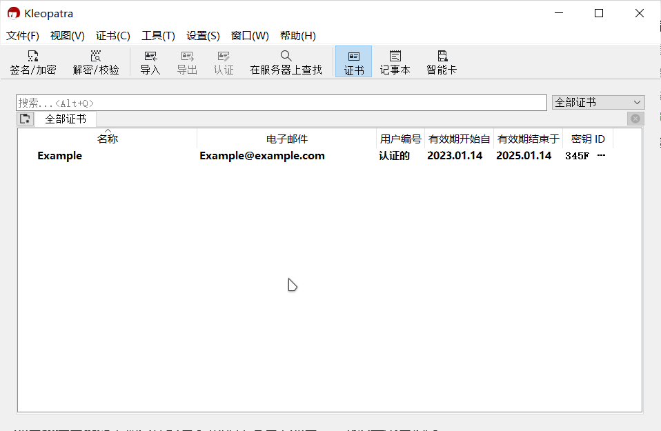
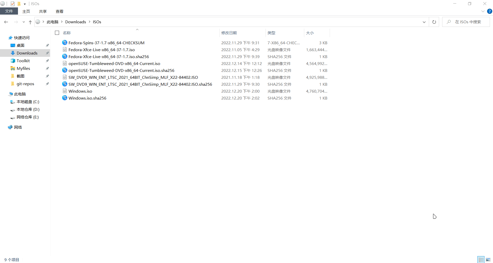

# 校验文件

!!! note "注意"

    - 本文主要描述如何快速地校验文件，有关 GPG 的更多信息详见：<https://gnupg.org/>；
    - 有关哈希函数的详细介绍另见：<https://en.wikipedia.org/wiki/Hash_function>
    - 本文假定读者仍在使用 Windows。

虽然 ISO 文件损坏的情况很少发生，但计算 ISO 文件的校验并与官方的校验和进行对比，同时验证一下 ISO 的签名是否被篡改并非多此一举。

如果你觉得检验文件很繁琐，可以直接跳转到下一篇文本

所需的工具：

- [7-zip](https://www.7-zip.org/)
- [GnuPG](https://gnupg.org/)
- 文本编辑器

<center>


</center>

## 下载校验文件

=== "openSUSE"

    - 安装镜像：[openSUSE Tumbleweed (x86_64, DVD)](https://opentuna.cn/opensuse/tumbleweed/iso/openSUSE-Tumbleweed-DVD-x86_64-Current.iso) [约 4.7GB]
    - ISO 文件校验文件：[ISO Cheksum](https://opentuna.cn/opensuse/tumbleweed/iso/openSUSE-Tumbleweed-DVD-x86_64-Current.iso.sha256)
    - ISO 签名文件：[ISO signature](https://opentuna.cn/opensuse/tumbleweed/iso/openSUSE-Tumbleweed-DVD-x86_64-Current.iso.sha256.asc)

=== "Fedora"

    - 安装镜像：[Fedora 37 (x86_64, Workstation)](https://opentuna.cn/fedora/releases/37/Workstation/x86_64/iso/Fedora-Workstation-Live-x86_64-37-1.7.iso) [约 2GB]
    - ISO 文件校验文件：[ISO Cheksum](https://opentuna.cn/fedora/releases/37/Workstation/x86_64/iso/Fedora-Workstation-37-1.7-x86_64-CHECKSUM)

通过上述链接，你会获得如下三个或两个文件：

```
Fedora-Workstation-37-1.7-x86_64-CHECKSUM
Fedora-Workstation-Live-x86_64-37-1.7.iso

openSUSE-Tumbleweed-DVD-x86_64-Current.iso
openSUSE-Tumbleweed-DVD-x86_64-Current.iso.sha256
openSUSE-Tumbleweed-DVD-x86_64-Current.iso.sha256.asc
```

请将它们放置在同一个文件夹之中。

## 初始化 GnuPG

### 安装

你需要先下载适用于 Windows 系统的 [Gpg4win](https://gpg4win.org/download.html)，然后根据提示安装 Gpg4win。

!!! note "注意"

    - 下载站点会请求你对 Gpg4win 项目进行捐款，你可以使用页面上提示的支付方式进行赞助 Gpg4win 项目的运营；或者选择 0$ 直接下载安装包。
    - 如果你不清楚你在做什么，直接遵循 Gpg4win 安装程序的默认推荐值即可。

### 获取公钥

Gpg4win 安装完成后，打开开始菜单，找到并启动名为 Kleopatra 的应用程序：


点击**新建密钥对**，输入你的名字和邮件地址，点击 **OK** 确认生成密钥对，例如：



然后点击设置，选择**配置 Kleopatra**，在 **S/MIME 校验**中设定好 http 代理地址：

!!! tip "网络代理"

    你也可以直接在代理软件中开启系统代理。


点击此页面上方的**在服务器上查找**，然后在弹出的对话框中输入 “openSUSE”，找到并导入 *`openSUSE Project Signing Key<opensuse@opensuse.org>`*：


同样地，以相似的步骤导入来自 *`fedora(37)<fedora-37-primary@fedoraproject.org>`*[^1] 的公钥。

### 验证签名

点击 Kleopatra 菜单栏上的**解密/校验**，选择对应的 sha256 文件或者 CHECKSUM 文件，进行校验：


## 校验哈希值

!!! attention "注意"

    - 请不要修改 SHA256 值，直接复制黏贴即可；
    - 文件名必须和要校验的文件的文件名保持一致；
    - sha256 文件必须和要校验的文件处于同一个文件夹中。

此处推荐使用 [7-zip](https://www.7-zip.org/) 对文件进行校验。

选中已下载的 sha256 文件，在鼠标右键菜单中，使用 **CRC SHA** 菜单中的**测试压缩包：校验和**功能，如下：

!!! tip "注意"

    如果你没有看到相似的选项，你可能需要在 7-zip 的设置（工具→选项→7-Zip）中，取消勾选**层叠右键菜单**。



对于 `Fedora-Workstation-37-1.7-x86_64-CHECKSUM`，它的本质是一个纯文本文件，你可以使用编辑器打开它，然后把其中你需要的部分复制黏贴到一个新建的，以 `sha256` 为后缀名的纯文本文件中，例如：

```
# Fedora-Workstation-Live-x86_64-37-1.7.iso: 2037372928 bytes
SHA256 (Fedora-Workstation-Live-x86_64-37-1.7.iso) = 9c69005baafdba6e4ff04c1cf4779121b7fc9aacab80b4633394576da336a515
```

然后将如上的文件修改为（SHA256 值 + 文件名）：

```
9c69005baafdba6e4ff04c1cf4779121b7fc9aacab80b4633394576da336a515  Fedora-Workstation-Live-x86_64-37-1.7.iso
```

[^1]: Fedora 37 的公钥