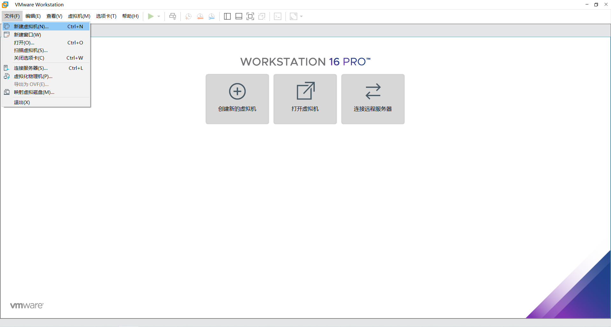
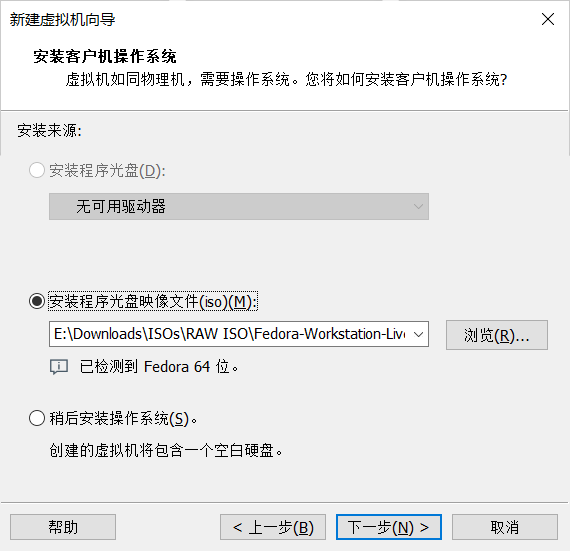
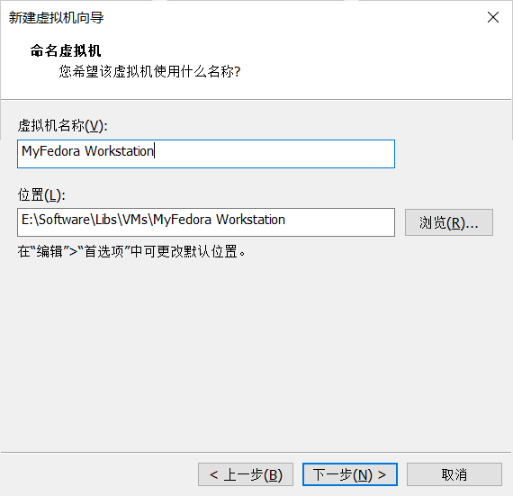
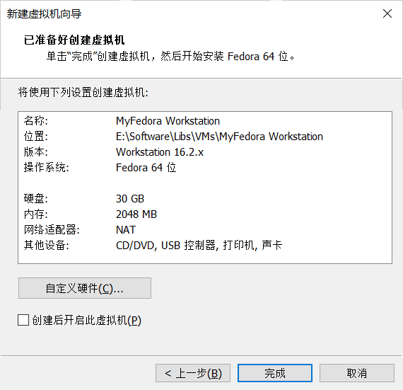
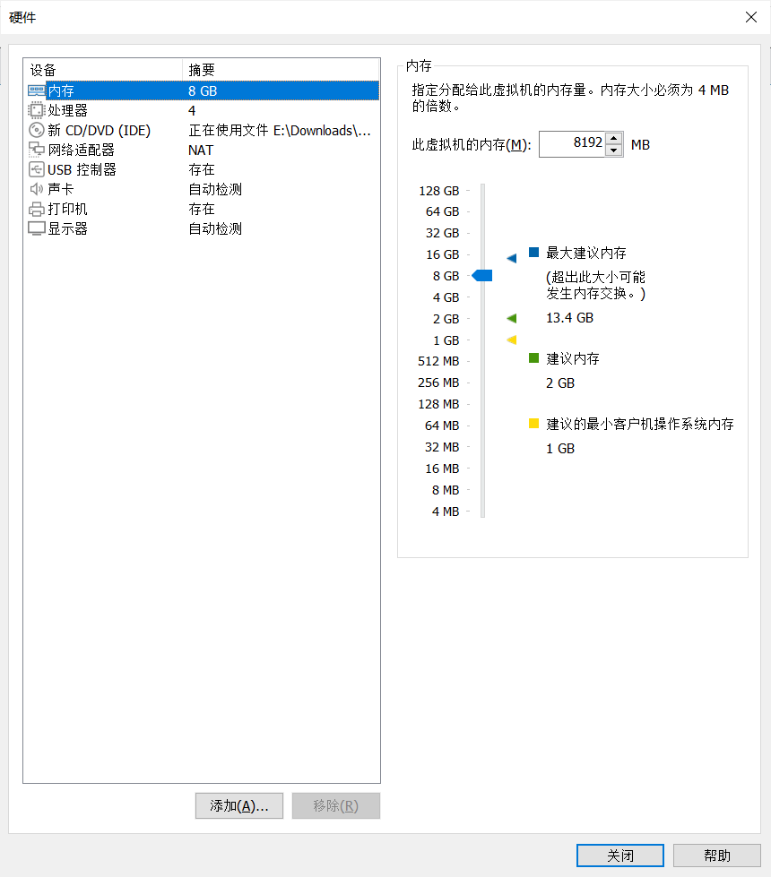

# 在虚拟机中安装 Linux

## 虚拟机与物理机

在不熟悉 Linux 基本知识的情况下，直接在物理机上安装 Linux 可能会导致数据丢失，或者是硬件损坏。

虚拟机作为一个让你再不破坏当前系统结构的情况下，能够获得最接近原生 Linux 环境体验的工具。非常适合 Linux 初学者安全地练习如何安装和使用 Linux。

!!! attention
    在物理机上安装 Linux 并非是必须的步骤，不安装到物理机上可以省去大量的迁移工作，但安装到物理机上会让系统具备更强的性能和更多的功能。

本文主要描述如何使用两种流行的虚拟机软件：

- [Virtualbox](https://www.virtualbox.org/)：自由，开源，免费。
- [VMware](https://www.vmware.com/products/workstation-pro.html)：历史悠久的企业级虚拟化产品，闭源，收费。

## Virtualbox

### 安装扩展包

扩展包主要提供了 USB 驱动和 3D 加速驱动等因版权无法自由分发的内容。 

1. 下载 [VirtualBox Oracle VM VirtualBox Extension Pack](https://www.virtualbox.org/wiki/Downloads)
2. 打开 VirtualBox ，点击**管理**，再点击**全局设定**，再点击**扩展**，再点击右侧的**添加新包**的小图标，安装你刚刚下载保持的扩展包文件。

### 新建虚拟机

!!! note
    将鼠标光标停留在某个选项上会显示该选项的简易使用说明。  
    注意，请将虚拟机安装在固态硬盘分区中以提高虚拟机的性能。  

打开 VirtualBox ，点击**新建** ，输入虚拟机的名称（VirtualBox 会根据你输入的名称快速筛选虚拟机的版本和类型），点击下一步。 

内存大小建议最小 2048 MB，具体的最低配置详见你所安装的系统版本的最低配置要求。点击下一步。 

选择默认的**现在创建虚拟硬盘**，类型可选为 VDI ，为了向外兼容，你可以考虑其他格式，具体相见 Virtualbox 和其他虚拟机的使用文档。点击下一步，选择**动态分配**，大小建议 20 GB 起步，具体的最低配置详见你所安装的系统版本的最低配置要求。点击下一步。 

### 配置虚拟机

在 VirtualBox 的首页，点击**设置** ，再点击**系统**；在**主板**页面，你可以点击勾选**启用 EFI**（某些系统需要用户启用 UEFI ，例如 Arch Linux）。在**处理器**页面，你可以更改虚拟机使用的**CPU 核心数**。

!!! note
     给虚拟机分配过多的资源会导致宿主机卡顿。你可以修改该页面中的启动顺序来改变虚拟机启动时引导设备的顺序。虚拟机系统安装完成后 VirtualBox 需要用户手动移除虚拟盘片。

在**显示**页面中，将**显存大小**拉满，可以考虑是否为虚拟机启用 3D 图形加速（具体取决于你的硬件性能）。 

!!! note
    如果你遇到无法调节虚拟机屏幕分辨率的问题，你可以在关闭虚拟机后，更换虚拟机使用的虚拟显卡或者关闭 3D 图形加速。

在**存储**中，点击**没有盘片** ，再点击**分配光驱**右侧的光碟小图标，再点击**选择虚拟盘**，找到并选中你准备好的 ISO 镜像文件。 

在 **USB 设备**中，点击右侧的**添加一个 USB 筛选器**，勾选你插入宿主机的 USB 设备。 

!!! note
    该步骤为可选操作。一旦启动虚拟机，你插入宿主机的 USB 设备就会自动被重定向到虚拟机中，并且在虚拟机关机前，你都不能在宿主机访问该 USB 设备。

在**共享文件夹**中，点击右侧的**添加共享文件夹** ，点击**共享文件夹路径**右侧的倒三角符号，点击**其他**，选择一个文件夹用于共享文件。然后勾选**自动挂载**。 

!!! note
    该步骤为可选操作。共享文件夹可以实现主宿机间文件的实时交流。请勿将虚拟机的任何程序或者程序所使用的文件夹安装或存放到共享文件夹中。虚拟机在共享文件夹所创建的，非你手动创建的文件，基本可以在使用完虚拟机后删除。

如果你在配置虚拟机的时候，没有指定使用的系统镜像文件。虚拟机在启动的时候会提醒你选择一个镜像文件。点击提示页面右侧的**选择一个虚拟光盘文件** ，再点击**注册**，找到并选中你下载的光盘文件，点击你新添加的镜像文件，再点击**选择**，确定无误后启动虚拟机。

### 安装增强功能

Virtualbox 会自动捕获用户的鼠标光标，你可以按 `右 Ctrl` 取消捕获。按 `右 Ctrl + F` 进入全屏。

为了能够让你的虚拟机的识别你的 USB 设备，你需要安装增强功能：点击菜单上方的**设备**，再点击**安装增强功能**。 

## VMWare Workstation

### 安装

打开[VMware Workstation Pro](https://www.vmware.com/cn/products/workstation-pro.html)，点击 **试用 Workstation 16 Pro** 进入下载页面。下载完成后，打开安装程序，依照引导提示完成安装。有关 VMware Workstation Pro 的商业授权使用详见[此处](https://store-us.vmware.com/vmware-workstation-16-pro-5424176500.html)。

如果你需要免费的 VMware 虚拟化产品，你可以选择使用 [VMware Workstation Player](https://www.vmware.com/cn/products/workstation-player.html)，此站点的 **比较** 页面分析了 Workstation Player 和 Workstation Pro 的差异，以及你适合哪一种产品。

### 新建虚拟机

在安装好 VMWare Workstation 后，打开 VMware，点击左上方**文件**，选择**新建虚拟机**。

在弹出的新建虚拟机向导中，点击**下一步**，然后选择**安装程序光盘映像文件**，打开你下载好的 Fedora ISO 文件。点击**下一步**：

在“命名虚拟机”中指定你的虚拟机的名称和虚拟机保存的位置。点击**下一步**：

在此页面，你可以指定虚拟机的**最大磁盘大小**，你可以使用默认值，或者指定更大的容量。完成后点击**下一步**：

在“已准备好创建虚拟机”页面中，检查虚拟机硬件配置是否合乎要求。你可以点击**自定义硬件**，自行调整配置。

完成后点击**完成**启动虚拟机。`Ctrl + Alt` 快捷键组合可以让 VMware 停止捕获你的鼠标。