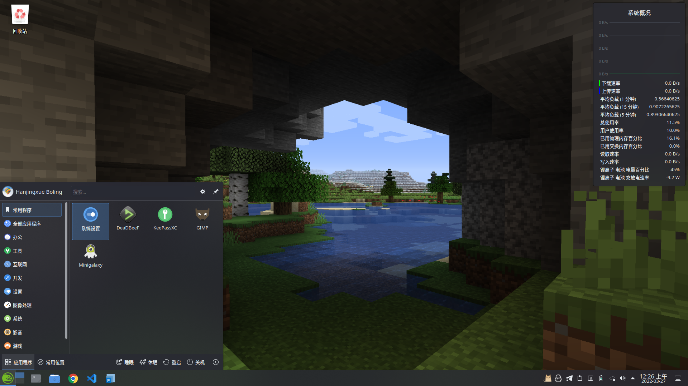
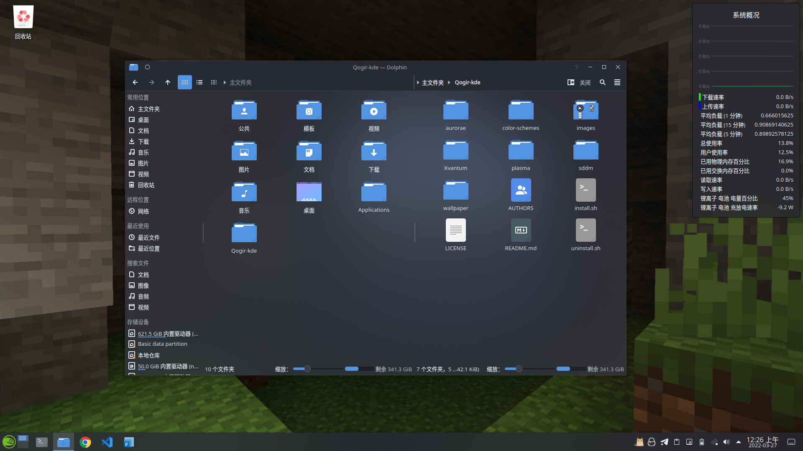
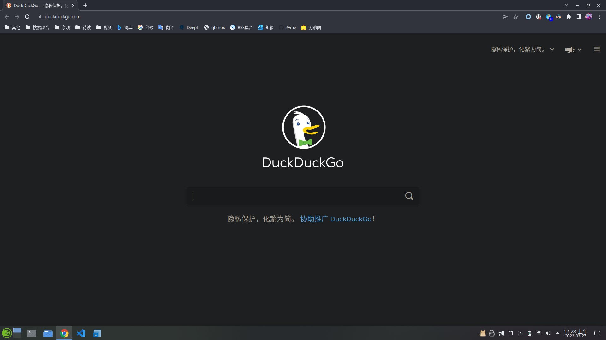
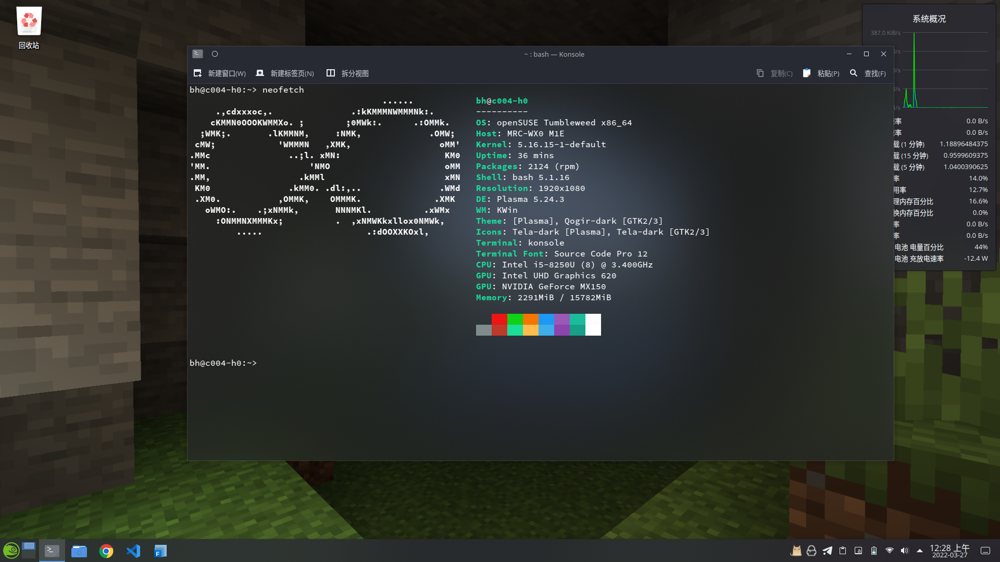
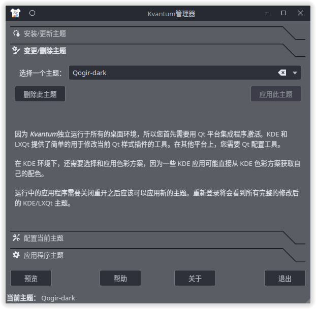
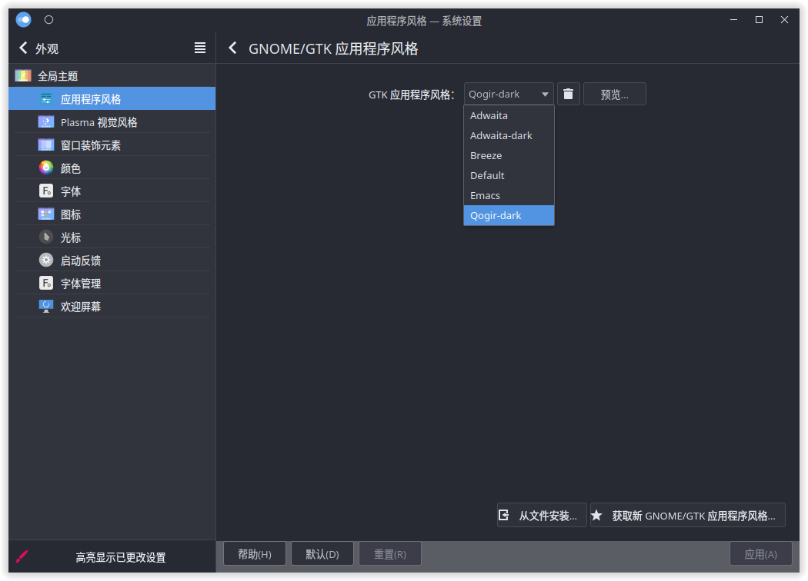

# openSUSE KDE 美化简易指南

## 效果预览

桌面：



文件管理器：



浏览器：



终端：



## 配置主题

### 修改内容

- 全局主题
- 应用程序风格
  - GNOME/GTK 应用程序风格 
- Plasma 应用程序风格
- 窗口装饰元素
- 图表
- 光标
- Konsole

### 配置前准备

由于我长期使用的设备是电脑而非手机，所以我会偏好于深色主题。你可以在 KDE 内嵌的主题下载器中下载主题，或者打开浏览器前往 [KDE Store](https://store.kde.org/browse/) 在线下载主题。

!!! Warning
    目前来说，要实现对具有复杂配置的 KDE 浅色/深色主题自动切换，还没有一个有效的解决方案。所以在深度美化 KDE 之前，你最好确定你需要哪种主题样式。

个人建议选择下载全局主题（Global Theme）而非零散的单个主题，这样视觉效果会更加协调。这里推荐一个优秀的主题设计师：[Vinceliuice](https://github.com/vinceliuice)。他发布了许多优雅美观的 [Qt](https://store.kde.org/u/vinceliuice)/[GTK 主题](https://www.gnome-look.org/u/vinceliuice)。

本次演示将使用 Vinceliuice 制作的：

- [Qogir-kde](https://github.com/vinceliuice/Qogir-kde)：全局主题
- [Qogir Theme](https://www.gnome-look.org/p/1230631/)：GNOME/GTK 应用主题
- [Qogir cursors](https://store.kde.org/p/1366182)：鼠标主题
- [Tela-icon-theme](https://store.kde.org/p/1279924)：应用图标包

!!! note
    如果为了图标样式更加协调统一，你可以使用 [Tela circle icon theme](https://store.kde.org/p/1359276) 圆形图标包。但是由于图标包并未能覆盖全部的图标，所以有时候会出现一些应用程序的图标不是圆形的情况。

打开终端：

!!! note
    如果你没有或不懂得如何使用 `git`，你可以打开[仓库页面](https://github.com/vinceliuice/Qogir-kde)，点击绿色的 Code 按钮，选择 **Download ZIP** 下载压缩包文件，再解压即可。

```
$ git clone https://github.com/vinceliuice/Qogir-kde.git #使用 git 克隆仓库
$ cd Qogir-kde
$ ./install.sh #执行自动安装脚本
```

然后将下载好的 `Qogir cursors` 和 `Tela-icon-theme` 解压。然后将它们都复制到 `~/.icons` 或者 `/usr/share/icons`。前者是用户自己的图标主题目录，后者是系统共享的图标主题目录（所有用户都可使用）。`Qogir Theme` GTK 主题暂时不需要解压。

然后安装 `kvantum-manager`

```
$ sudo zypper in kvantum-manager kvantum-manager-lang
```

### 调整设置

打开 KDE 的系统设置，在**外观**的**全局主题** 中，选择刚刚安装好的主题，如 `Qogir Dark`。然后分别在**图标**和**光标**中选择你安装的主题，如 `Tela-dark` 和 `Qogir-white-cursors`。


!!! note
    - 由于个人认为 Kvantum Manager 默认配置的样式效果已经很完善了，所以不作过多的修改。如果希望进行更为精细的配置，可自行搜索相关的文章和教程。  
    - 安装脚本已经自动安装好 Kvantum 主题了，如果你选用了其他的 Kvantum 主题，你需要先解压文件，然后再用 Kvantum Manager 安装此 Kvantum 主题。

在**应用程序风格**中，选择 `Kvantum` 作为应用程序风格。打开 Kvantum Manager，点击**变更和删除主题**，选择你需要的 Kvantum 主题样式，确认并应用主题，如下：



在**应用程序风格**中，点击右下方的**配置 GNOME/GTK 应用程序风格**，然后点击**从文件安装**，选择你下载好的 `Qogir Theme` GTK 主题压缩包文件；再点击上方的 **GTK 应用程序风格**，在列表中选中你刚刚安装的主题，保存确认，如下：



最后，重启系统以应用新主题。

#### 不必修改的内容

grub 和登陆界面的主题样式虽然可以自定义，但不必更改。因为它们出现的时间短。并且用户更多时候是在使用应用程序而非登陆界面之类的东西。

### 配置其他应用程序

其他应用的主题样式一般可以设置为跟随系统或系统默认。

#### Konsole

打开 Konsole，点击菜单栏的 **设置**>**配置 Konsole**>**配置方案**，新建一个新的配置方案。然后在**外观**页面中，选择一种你喜欢的配色方案和字体，点击右方的**编辑**，勾选**模糊背景**，并设置背景透明度（推荐 20%～30%）。其余内容请按照自身需要自行调整。如下：


#### 浏览器

推荐使用 [Dark Reader](https://github.com/darkreader/darkreader) 插件（支持基于 chromium 和 Firefox 的浏览器），使浏览器具备自动切换浅深色模式的功能。

## 壁纸

!!! note
    好看的主题也需要搭配好看的壁纸。

### 在线壁纸下载

- [Wallhaven](https://wallhaven.cc/)  
  大型壁纸下载网站
- [Pexels](https://www.pexels.com/zh-cn/)  
  才华横溢的摄影作者在这里免费分享最精彩的素材图片和视频。
- [Pixabay](https://pixabay.com/)  
  我们才华横溢的社区分享了超过 250 万张高质量的图片、视频和音乐。
- [Pixiv](https://www.pixiv.net/)  
  知名同人插画分享站点
- [初之图库](https://img.himiku.com/)  
  本站是由 mikusa 个人维护的琉璃神社壁纸包来源站。
- [Deviantart](https://www.deviantart.com/topic)  
  许多艺术创作的在线发布站点
- [Flickr](https://www.flickr.com/)  
  包含使用 [CC 许可证](https://creativecommons.org/)进行分发的免费图片和其他内容。

### 桌面、登陆与锁屏

对于这三者，我的看法是选用一张好看的壁纸比好看的主题样式更为有效。

- 对于桌面：  
  将下载的壁纸放入一个文件夹中，然后在桌面点击鼠标右键菜单中的**配置桌面和壁纸**，在**文件夹中**添加你的壁纸文件夹即可。
- 登陆界面：
  配置入口在：系统设置>开机与关机>登陆屏幕（SDDM）
- 锁屏界面：  
  配置入口在：系统设置>工作区行为>锁屏>外观