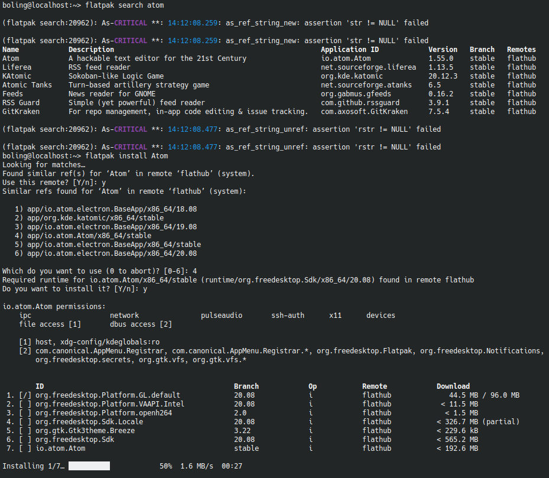

## 简介

[Flatpak](https://www.flatpak.org/) 是一个用于 Linux 软件部署和包管理的实用程序。 它被宣传为提供沙盒环境，用户可以在其中运行应用程序软件，与系统的其余部分隔离。Flatpak 是作为 freedesktop.org 项目（以前称为 X Desktop Group 或 XDG）的一部分开发的，最初称为 xdg-app[^1]。

## 部署

安装基本程序：

```
sudo zypper in flatpak #在 openSUSE 上安装 flatpak
sudo dnf in flatpak #在 fedora 上安装 flatpak
```

添加远程仓库：

```
flatpak remote-add --if-not-exists flathub https://flathub.org/repo/flathub.flatpakrepo
```

## 安装后预处理

### 镜像

如果你访问 Flatpak 官方镜像很困难，无法正常下载，可以阅读:

- [flathub - 上交大镜像服务](https://mirror.sjtu.edu.cn/docs/flathub)
- [试用为中国大陆用户打造的 Flathub 镜像](https://zh.fedoracommunity.org/2020/05/13/try-on-flatpak-mainland-china-mirror.html)

### 编辑环境变量

Flatpak 期望窗口管理器尊重 `XDG_DATA_DIRS` 环境变量来发现应用程序。此变量由脚本 `/etc/profile.d/flatpak.sh` 设置。 更新环境可能需要重新启动会话。 如果启动器不支持 `XDG_DATA_DIRS`，你可以编辑扫描的目录列表并将其添加到其中[^2]：

```
~/.local/share/flatpak/exports/share/applications
/var/lib/flatpak/exports/share/applications
```

使用脚本自动完成添加变量：

```
cd /etc/profile.d/ && sudo sh ./flatpak.sh
```

然后重新登陆即可

### 加入 Flatpak 用户组

```
sudo usermod -aG flatpak $USER
```

然后重启即可。

如果你不加入 `flatpak` 用户组，则无法通过桌面环境的启动器启动程序，并需要使用 `flatpak` 命令在终端中启动程序，如：

```
flatpak run org.freefilesync.FreeFileSync #运行 FreeFileSync
```

## 简易使用[^3]

!!! note
    请不要使用 `sudo` 命令运行 `flatpak`。以免导致一些预期之外的问题。

查看用户手册：

```
flatpak --help
```

检索软件：

```
flatpak search [软件名称] #如： flatpak search atom
```

安装软件：

```
flatpak install [软件名称] #如： flatpak install Atom
```

运行软件：

```
flatpak run [应用 ID] #如： flatpak run io.atom.Atom
```

查看已安装的软件：

```
flatpak list
```

卸载软件：

```
flatpak uninstall [软件名称]
```

更新软件：

```
flatpak update [软件名称]
```

### 注意事项

**请先搜索软件，然后再安装软件，以免安装错误的包名类似的软件。**需要注意 `flatpak search` 的输出结果中，你所需软件对应的应用 ID（如，Atom 的应用 ID 是 `io.atom.Atom`，所以在 `flatpak install` 的输出类似搜索结果列表中，应当选择 `4）app/io.atom.Atom/x86_64/stable`，而不是其他包名不相符的选项。如下：



## 外部链接

- [Flatpak 仓库总览 | 在线搜索](https://flathub.org/apps/category/All)

[^1]: https://en.wikipedia.org/wiki/Flatpak
[^2]: https://wiki.archlinux.org/title/Flatpak#Adding_Flatpak_.desktop_files_to_your_menu
[^3]: https://zh.opensuse.org/Flatpak