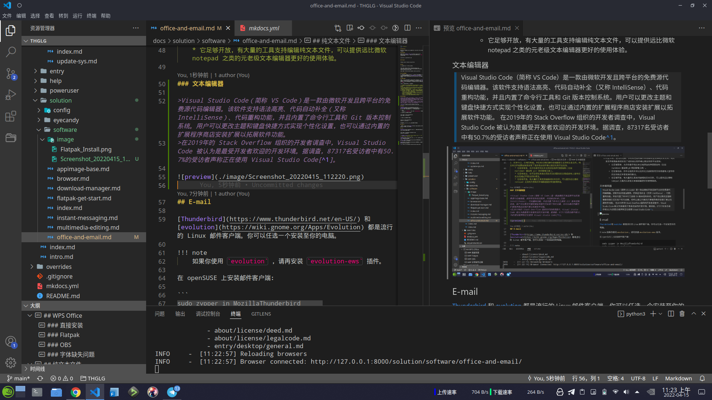

## WPS Office

WPS Office 套件支持 Linux 系统，并且是 Microsoft office 的优秀替代品。

### 直接安装

你可以直接在 [WPS For Linux 官网](https://www.wps.com/office/linux/)下载适用于 Fedora 的 rpm 安装包，然使用 `rpm`  命令安装 WPS:

```
$ sudo rpm -i wps-office-*.rpm
```

### Flatpak

!!! bug
    现有的 Flatpak 版是 wps 国际版，不包含中文语言包。

```
flatpak install flathub com.wps.Office
```

### OBS

在 openSUSE 上通过 OBS 仓库安装：

```
sudo zypper addrepo https://download.opensuse.org/repositories/home:fusionfuture:office/openSUSE_Tumbleweed/home:fusionfuture:office.repo

sudo zypper refresh && sudo zypper install wps-office
```

### 字体缺失问题

由于许可证的原因，WPS 不能携带一些 windows 字体，你需要自行去搜索下载相关的字体文件。你可以在 [BannedPatriot/ttf-wps-fonts](https://github.com/BannedPatriot/ttf-wps-fonts) 下载缺失的字体。

## 纯文本文件

除了使用 docx 之类的文档格式记录信息，你也可以了解一下 [markdown](https://markdown.com.cn/)。Markdown 是一种轻量级标记语言，它允许人们使用易读易写的纯文本格式编写文档，Markdown 文件的后缀名便是 `.md`。

同时，使用纯文本文件也有几项优点：

1. 不再需要去关注，去比较各种商业软件公司的不断循环开发的，使用不兼容通用文档格式标准的私有文档格式的软件。并为之付出一笔可能并不需要花费的钱。
2. 商业公司不在乎你的文档能不能在数年后仍然可读，不在乎你是否能够真正与其他用户无缝交流，他们只在乎能不能将你和他们的产品绑定在一起，从而实现对你进行收费的终极目的。
3. 时至今日，任何的电脑，手机和任意的操作系统都原生支持纯文本文件。纯文本文件依靠自身就实现了诸多商业软件难以搞定的跨平台支持。  
    * 它足够简单，允许你基于纯文本文档添加各种顶层结构（比如 markdown 语法和 git 项目管理工具）。  
    * 它足够自由，你不必担忧未来出现你无法读取你的文档或者有人宣布你的文档格式不受支持的情况。  
    * 它足够开放，有大量的工具支持编辑纯文本文件，可以提供远比微软 notepad 之类的元老级文本编辑器更好的使用体验。

### VScode

[Vscode](https://code.visualstudio.com/) 是一个非常流行的免费源代码编辑器。

>Visual Studio Code（简称 VS Code）是一款由微软开发且跨平台的免费源代码编辑器。该软件支持语法高亮、代码自动补全（又称 IntelliSense）、代码重构功能，并且内置了命令行工具和 Git 版本控制系统。用户可以更改主题和键盘快捷方式实现个性化设置，也可以通过内置的扩展程序商店安装扩展以拓展软件功能。  
>在2019年的 Stack Overflow 组织的开发者调查中，Visual Studio Code 被认为是最受开发者欢迎的开发环境。据调查，87317名受访者中有50.7%的受访者声称正在使用 Visual Studio Code[^1]。



#### 安装

- 在 Fedora 上安装：  
    添加软件源：
    ```
    sudo rpm --import https://packages.microsoft.com/keys/microsoft.asc
    sudo sh -c 'echo -e "[code]\nname=Visual Studio Code\nbaseurl=https://packages.microsoft.com/yumrepos/vscode\nenabled=1\ngpgcheck=1\ngpgkey=https://packages.microsoft.com/keys/microsoft.asc" > /etc/yum.repos.d/vscode.repo'
    ```
    然后检查更新，并安装 vscode：
    ```
    sudo dnf check-update && sudo dnf install code
    ```
- 在 openSUSE 上安装：  
    添加软件源：
    ```
    sudo rpm --import https://packages.microsoft.com/keys/microsoft.asc
    sudo sh -c 'echo -e "[code]\nname=Visual Studio Code\nbaseurl=https://packages.microsoft.com/yumrepos/vscode\nenabled=1\ntype=rpm-md\ngpgcheck=1\ngpgkey=https://packages.microsoft.com/keys/microsoft.asc" > /etc/zypp/repos.d/vscode.repo'
    ```
    刷新软件源，并安装 vscode：  
    ```
    sudo zypper ref && sudo zypper in code
    ```

或者通过 Flatpak 安装：

```
flatpak install flathub com.visualstudio.code
```

#### VScode 插件

推荐安装的扩展有

- Chinese (Simplified) (简体中文) Language Pack for Visual Studio Code - Microsoft
- GitLens — Git supercharged - GitKraken  
    多合一的 git 工具箱  
- Markdown All in One - Yu Zhang  
    多合一的 md 文档插件  
- Material Icon Theme - Philipp Kief  
    显示效果更清晰的图标主题  
    
- Project Manager - Alessandro Fragnani  
    git 项目管理器（便捷地在多个 git 项目间切换） 

### Kate

[Kate](https://apps.kde.org/kate/) 是 KDE 预置的文本编辑器，也支持非常多的功能。

## E-mail

[Thunderbird](https://www.thunderbird.net/en-US/) 和 [evolution](https://wiki.gnome.org/Apps/Evolution) 都是流行的 Linux 邮件客户端。你可以任选一个安装至你的电脑。

!!! note
    如果你使用 `evolution` ，请再安装 `evolution-ews` 插件。

在 openSUSE 上安装邮件客户端：

```
sudo zypper in MozillaThunderbird 
sudo zypper in evolution
```

在 Fedora 上安装邮件客户端：

```
sudo dnf in MozillaThunderbird 
sudo dnf in evolution
```

或者你可以使用浏览器使用在线的网页邮件客户端。

## 思维导图

开源的在线思维导图工具：[draw.io](https://app.diagrams.net/#)。draw.io 还支持 Linux 平台。

## 字典

[Goldendict](http://goldendict.org/) 是一个功能强大，支持诸多字典格式的字典查词软件。

```
sudo zypper in goldendict goldendict-lang
sudo dnf in goldendict
```

- [FreeMdict Forum](https://forum.freemdict.com/) 是一个聚焦于各类字典与使用的爱好者论坛。

[欧陆词典](https://dict.eudic.net/) 也是一个流行的字典软件，但 Linux 版不支持屏幕取词。

[Bing 在线词典](https://www4.bing.com/dict?FORM=HDRSC6) 是一个简单易用的在线网络词典。

[DeepL](https://www.deepl.com/translator)：免费的在线翻译引擎，由人工神经网络驱动。

[^1]: https://zh.wikipedia.org/wiki/Visual_Studio_Code